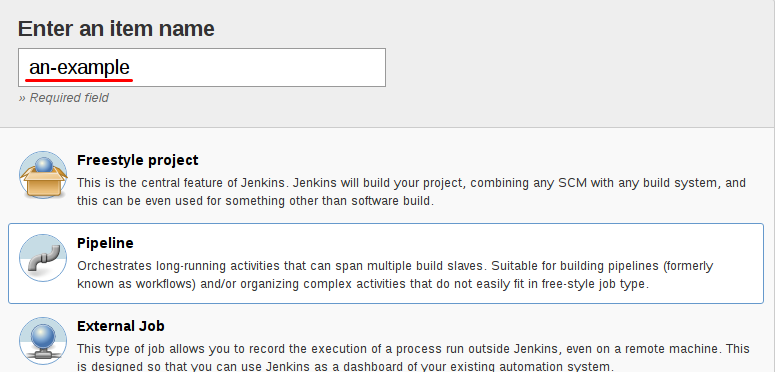

# Jenkins Pipelines

>>>>NEWSLIDE
# Jenkins revisited
Picture of Jenkins


>>>>NEWSLIDE
# Introducing Pipelines
No more pointy pointy, cliky cliky


>>>>NEWSLIDE
## Reasons
* It's just code, put it with your source is!
* Traceability *(how did the pipeline looked like in version 1.2?)*
* Better support for parallel executions

>>>>NEWSLIDE
# Jenkins Pipeline
[Jenkins Pipeline](https://jenkins.io/doc/book/pipeline/) is a suite of plugins which supports implementing and integrating continuous delivery pipelines in Jenkins.

>>>>NEWSLIDE
# Vocabulary

* Stage
* Node
* Step

>>>>NEWSLIDE
2 Approaches:

Declarative or Scripted

>>>>NEWSLIDE
Declarative Jenkinsfile
```
pipeline {
    agent any

    stages {
        stage('Build') {
            steps {
                sh 'make'
            }
        }
        stage('Test'){
            steps {
                sh 'make check'
                junit 'reports/**/*.xml'
            }
        }
        stage('Deploy') {
            steps {
                sh 'make publish'
            }
        }
    }
}
```
>>>>NEWSLIDE
Scripted Jenkinsfile

```
node {
    stage('Build') {
        sh 'make'
    }

    stage('Test') {
        sh 'make check'
        junit 'reports/**/*.xml'
    }

    stage('Deploy') {
        sh 'make publish'
    }
}
```


>>>>NEWSLIDE
Two job-types for pipelines

- Pipeline
- Multi-branch Pipeline

>>>>NEWSECTION
# My first pipeline

>>>>NEWSLIDE
Create a new job in Jenkins. Give it a good name and select the 'pipeline' type

[Getting Started](https://jenkins.io/doc/book/pipeline/getting-started/) provides nice help for those new to this.


>>>>NEWSLIDE
# Making your first pipeline 
## hello world + checkout of sourcecode.

>>>>NEWSECTION
# Stages and pack/unpack

>>>>NEWSLIDE
# Stages


>>>>NEWSECTION
# Parallel and archiving

>>>>NEWSLIDE


>>>>NEWSECTION
# Multibranch pipeline

>>>>NEWSLIDE
Create a new job in Jenkins where you select the 'Multi-branch pipeline' type.

[Jenkins.io](https://jenkins.io/doc/book/pipeline/multibranch/) has a nice guide on how to get going.

[A better pipeline](http://localhost:8080/view/Pipelines/job/BetterPipeline/)


>>>>NEWSECTION
# Pretested integration flow

>>>>NEWSECTION
# Docker
