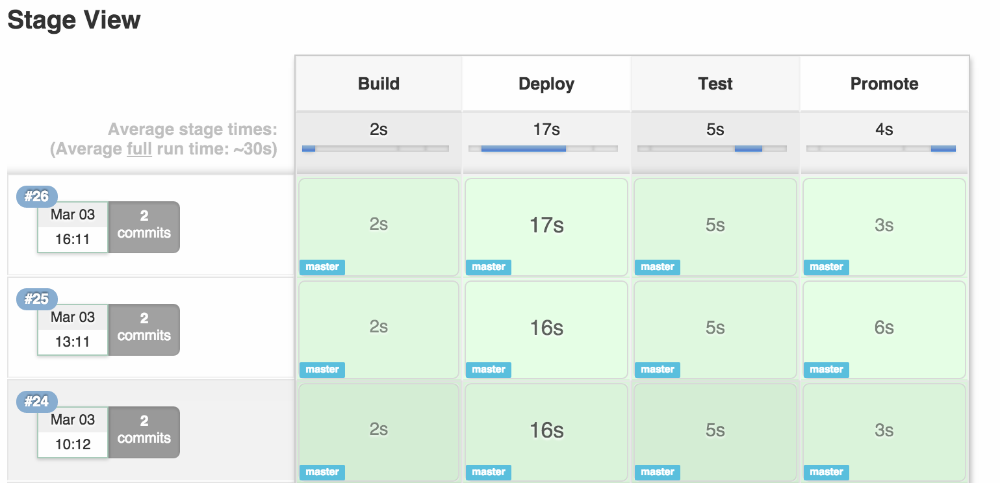
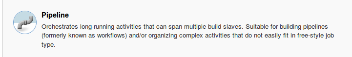
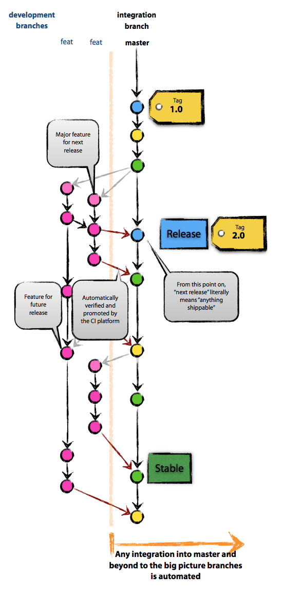
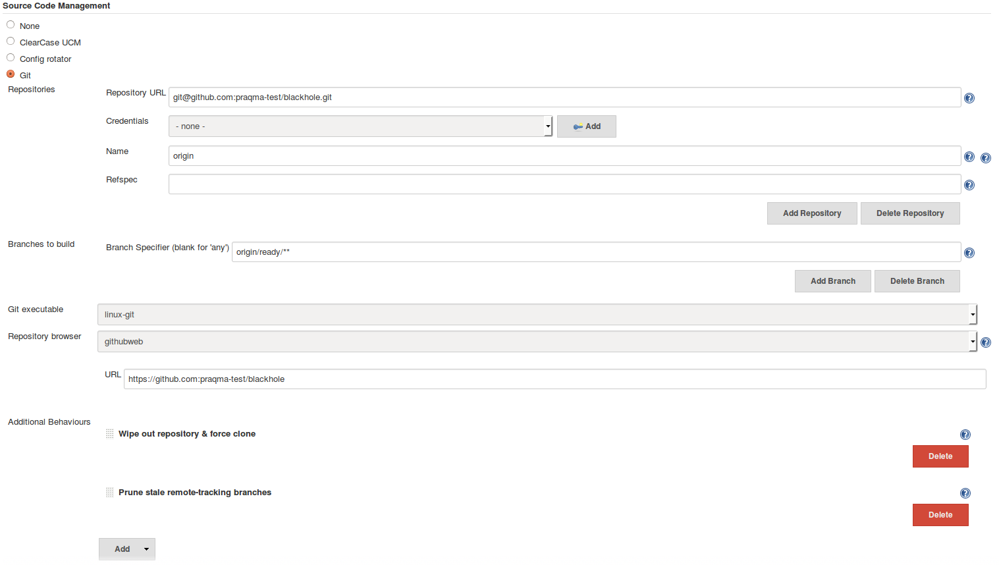
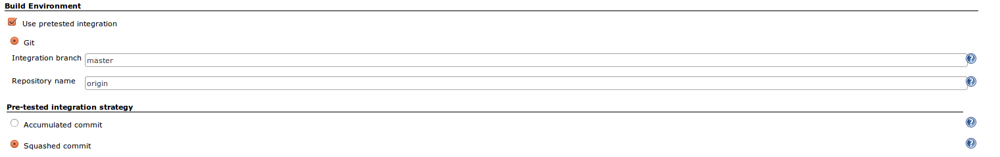

# Jenkins Pipelines


>>>>NEWSLIDE
# Introducing Pipelines
No more pointy pointy, cliky cliky


>>>>NEWSLIDE
## Reasons
* Configuration as code, put it with your source is!
* Traceability *(how did the pipeline look in version 1.2?)*
* Better support for parallel executions
* Better UI overview of each stage

>>>>NEWSLIDE
# Jenkins Pipeline
[Jenkins Pipeline](https://jenkins.io/doc/book/pipeline/) is a suite of plugins which supports implementing and integrating continuous delivery pipelines in Jenkins.

>>>>NEWSLIDE
# Vocabulary

* Stage
* Node
* Step

>>>>NEWSLIDE
## 2 Approaches:

Declarative or Scripted

**We chose scripted**

>>>>NEWSLIDE
## UI
Showing the stages of the pipeline


>>>>NEWSLIDE
## Scripted Jenkinsfile

```
node {
    stage('Build') {
        sh 'make'
    }
}
```
>>>>NEWSLIDE
## Scripted Jenkinsfile
Several nodes
```
node('linux') {
    stage('Build') {
        sh 'make'
    }
}
node('linux&&ubuntu') {
    stage('Test') {
        sh 'make check'
        junit 'reports/**/*.xml'
    }
}
node('linux&&deployment'){
    stage('Deploy') {
        sh 'make publish'
    }
}
```

>>>>NEWSLIDE
Two job-types for pipelines

- Pipeline



- Multi-branch Pipeline


>>>>NEWSECTION
# My first pipeline

>>>>NEWSLIDE
Create a new job in Jenkins.

Give it a good name and select the 'pipeline' type

[Getting Started](https://jenkins.io/doc/book/pipeline/getting-started/) provides nice help for those new to this.


>>>>NEWSLIDE
## Making your first pipeline
Make exercise 5+6 in the [Gilded rose repository](https://github.com/praqma-training/gildedrose).


>>>>NEWSECTION
## Additional methods:
- Archiving

```
// archiving the jar files in the target folder
archiveArtifacts 'target/*.jar'

```


>>>>NEWSLIDE
## Additional methods:
- Docker

```
node{
withDockerContainer('ubuntu:latest') {
    sh 'echo "hello world"'
}}

```

or

```
node{
sh 'docker run -i --rm --name my-maven-project -v "$PWD":/usr/src/mymaven -w /usr/src/mymaven maven:3-jdk-8 mvn -Dmaven.test.failure.ignore clean package'
}
```


>>>>NEWSECTION
## Multibranch pipeline

Creates a set of Pipeline projects according to detected branches in one SCM repository.

So every branch on your remote becomes a pipeline. Just push and it will be triggered!


>>>>NEWSECTION
## Advanced methods
- Parallel

```
// Define
def builders = [
	"build": {
		node {}
	},
	"javadoc": {
	node {}
	}
]
stage('parallel'){
	parallel builders
}

```

- Stash/unstash
```
// archiving the jar files in the target folder
archiveArtifacts 'target/*.jar'

```

>>>>NEWSECTION
# Pretested integration flow

>>>>NEWSLIDE

The end goal:
- Our _master_ branch is _pristine_
- No bad code goes to master!

>>>>NEWSLIDE

The plan:
- Write-protect the master branch
- Have developers flag when they have code they want _integrated_
- Have Jenkins listen for branches to integrate
- Jenkins decides ( through tests ) whether or not the code can go to master

>>>>NEWSLIDE

The tools:
- Pretested Integration Plugin
- Listen for branches named `ready/**`
- Integrate into master branch

>>>>NEWSLIDE

<!--- TODO Take Thierrys Git Phlow drawing instead of this --!>

>>>>NEWSLIDE


>>>>NEWSLIDE

