# Jenkins #1

>>>>NEWSLIDE
## The story continues

>>>>NEWSLIDE
## Contents

* Build automation
* Hello, Jenkins World!
* CI: Fetching and building code

>>>>NEWSECTION

##Why bother?

* *"It works on my machine"*
* Environment differences
* Repetitive, manual work

>>>>NEWSLIDE
> "Our highest priority is to satisfy the customer
through early and continuous delivery
of valuable software."

## Why use a continuous integration server?

>>>>NEWSLIDE

> " Working software is the primary measure of progress. "

## Do my changes work:

  * on someone else's machine?
  * with everyone else's changes?
  * on all platforms?

>>>>NEWSLIDE

> "Deliver working software frequently, from a
couple of weeks to a couple of months, with a
preference to the shorter timescale."

## Does my software:

  * Build itself?
  * Test itself?
  * Deploy itself?

>>>>NEWSLIDE

> Simplicity--the art of maximizing the amount
of work not done--is essential.

## Is my team:

  * Automating repetitive manual work?
  * Discovering errors quickly?
  * Avoiding rework?

>>>>NEWSLIDE

## So, an automation platform helps us:

 * ensure our software is working
 * increase our development efficiency
 * work in teams
 * single source of truth

Not bad, eh?

>>>>NEWSECTION

##  Let's have a chat about the difference between CI and CoDe...
>>>>NEWSLIDE

Note:  Let's talk about the difference between CI and CoDe

>>>>NEWSLIDE

##  So for both CI and CoDe...we need an automation platform!

>>>>NEWSLIDE

##  We have options!

>>>>NEWSLIDE

## But today we choose jenkins!

>>>>NEWSECTION
# Hello, Jenkins World!

>>>>NEWSLIDE

>>>>NEWSLIDE

## Let's get to work!

    sudo apt-get install jenkins

>>>>NEWSLIDE

## Let's see what happened!

    # Go check <HOST_IP>:8080
    # Create a job
    # What happened?

>>>>NEWSLIDE

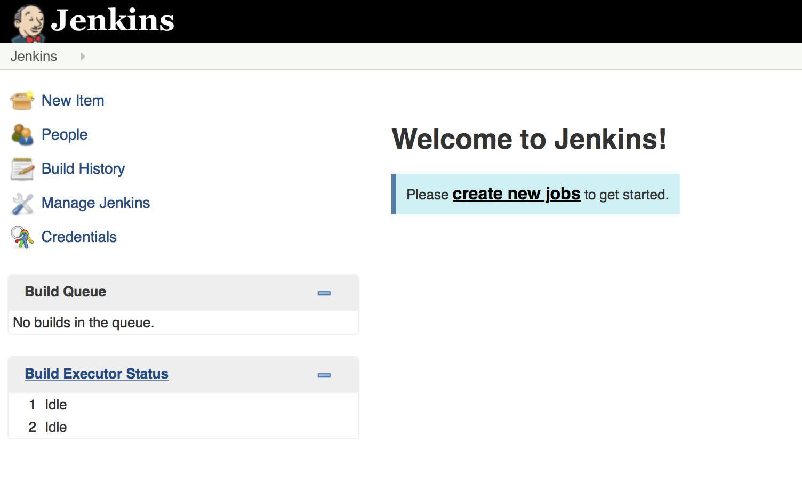

>>>>NEWSLIDE
# OK, now it's your turn!

    # Go check <HOST_IP>:8080
    # Create a job
    # What happened?

>>>>NEWSECTION
# Continuous Integration

## Is my code good enough to share with my team?

>>>>NEWSLIDE
## Let's "build" adventure time!

>>>>NEWSLIDE

## CI is:

* Fetch
* Integrate
* Run tests

>>>>NEWSLIDE
## A Job is an atomic unit of automation work
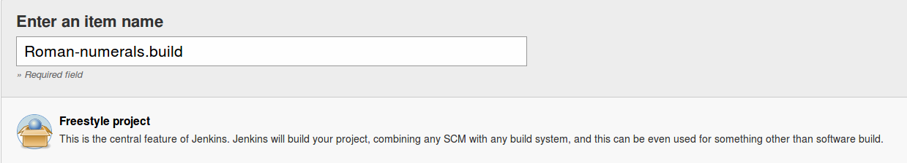

>>>>NEWSLIDE

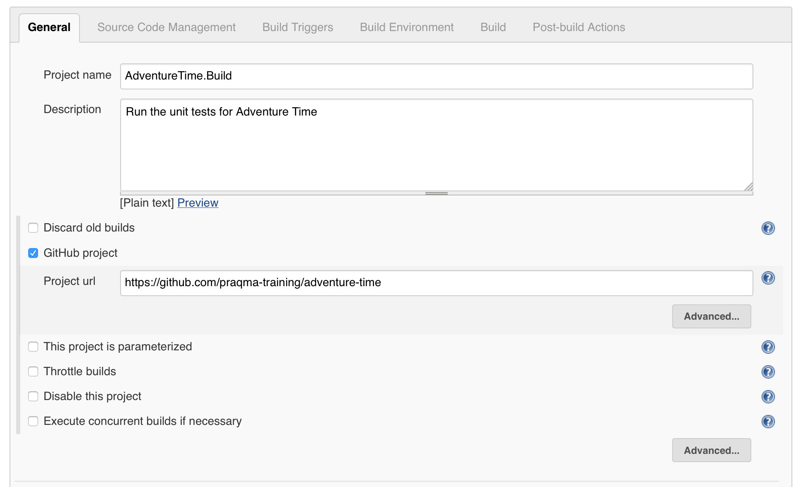

>>>>NEWSLIDE

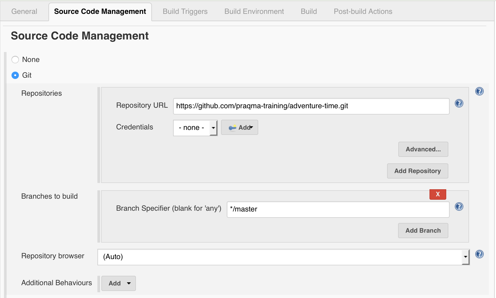

>>>>NEWSLIDE

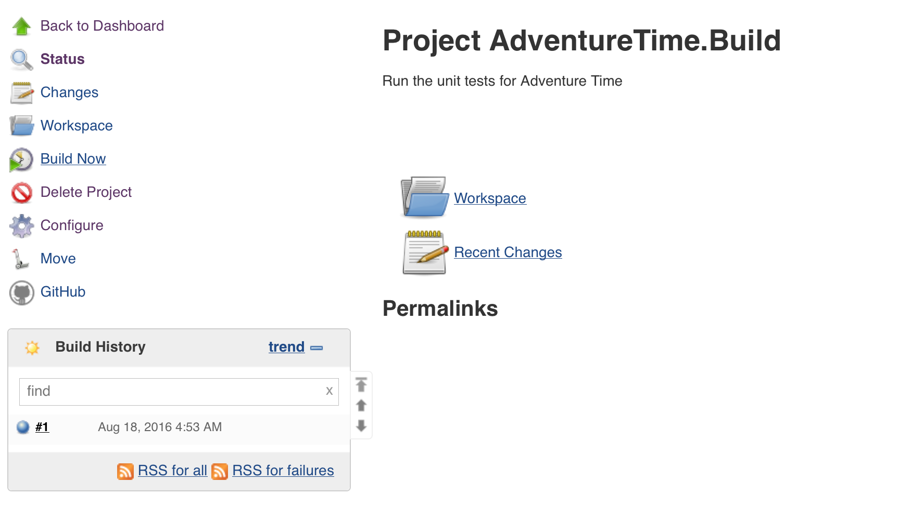

Note:
Here we want to show:

  * Build job
  * Workspac

>>>>NEWSLIDE

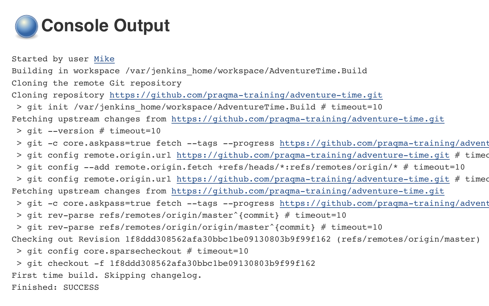

>>>>NEWSLIDE
# Ok, let's actually do a test

>>>>NEWSLIDE

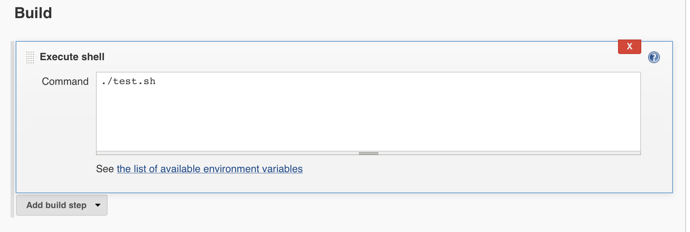
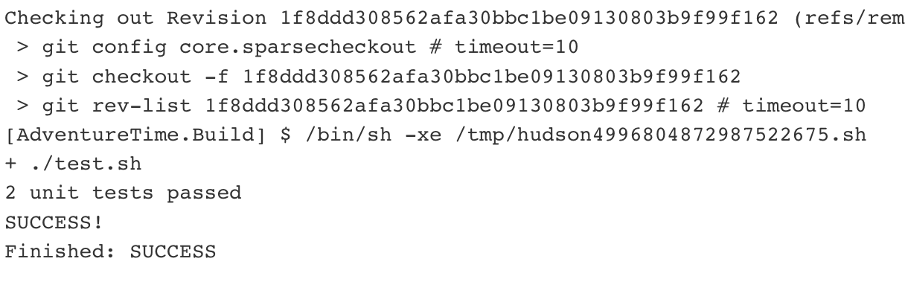

>>>>NEWSLIDE
# But can it fail?
## Now is the time to create your own fork...

>>>>NEWSLIDE

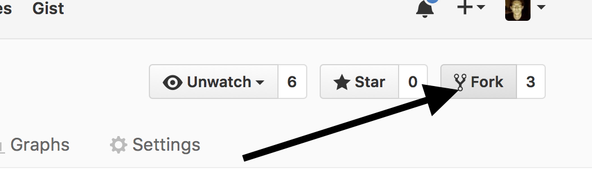
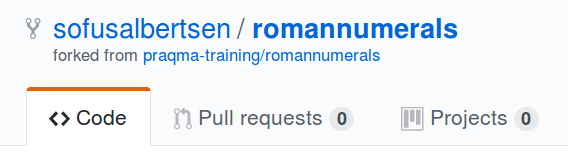

>>>>NEWSLIDE

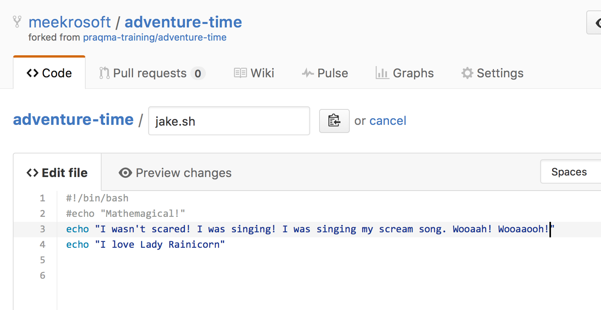

>>>>NEWSLIDE

## Remember to update the job urls!
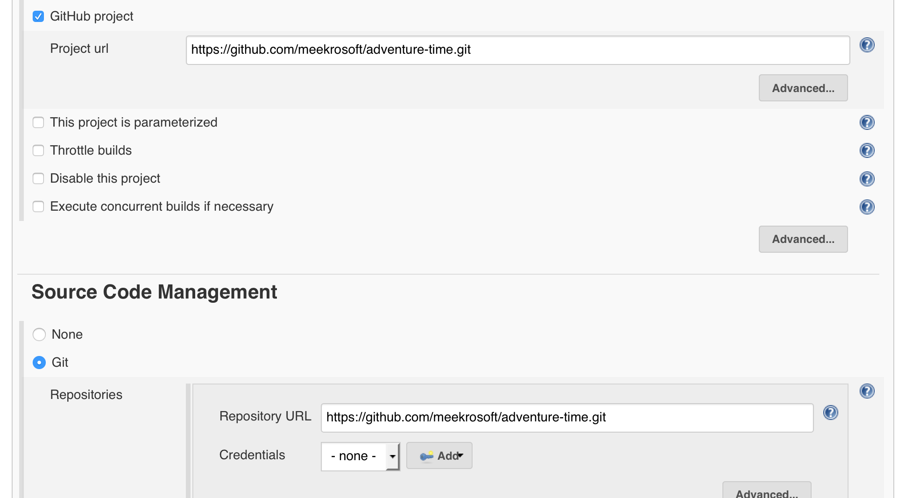

>>>>NEWSLIDE

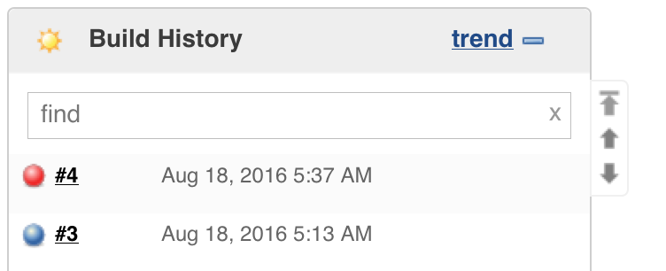

>>>>NEWSLIDE

## Task 1: make the build pass again
## Task 2: make the build run automatically
