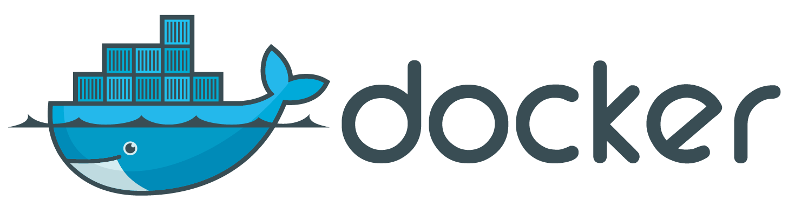
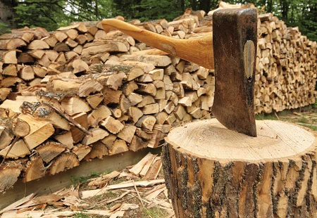
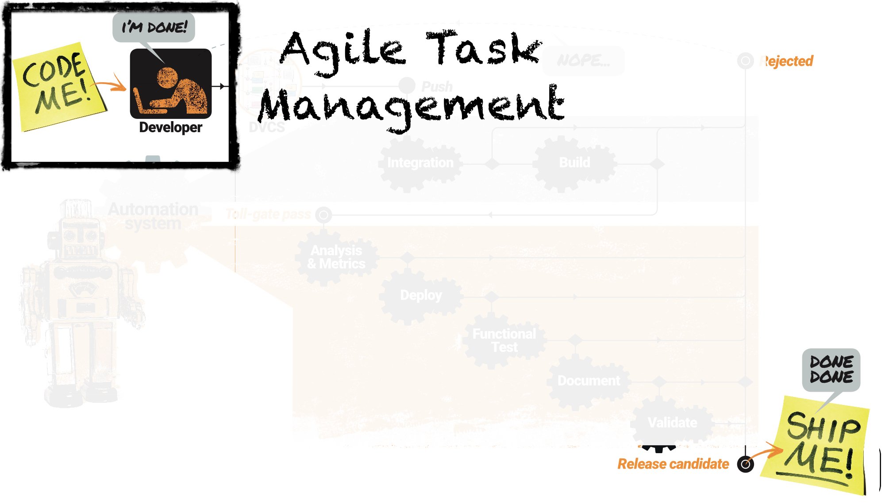
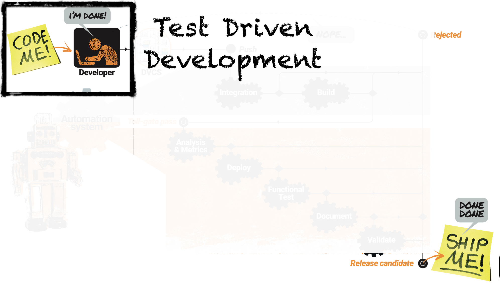
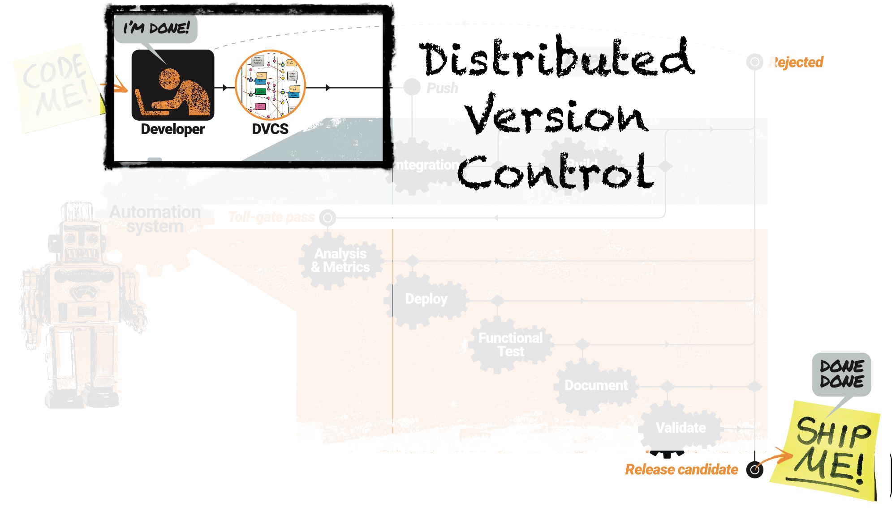
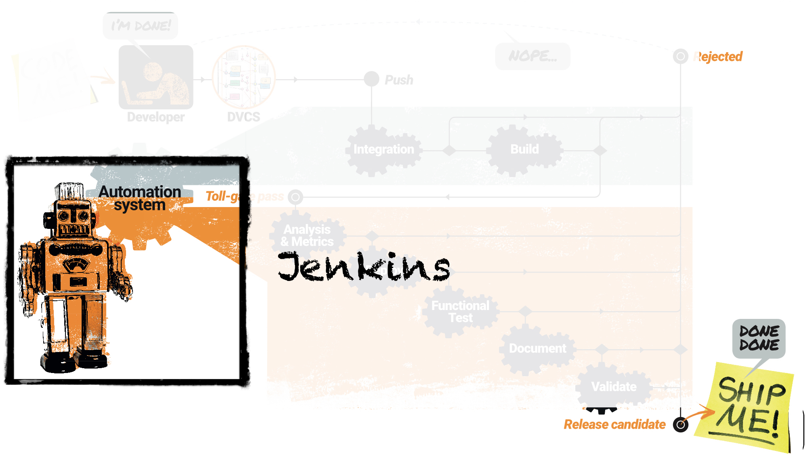
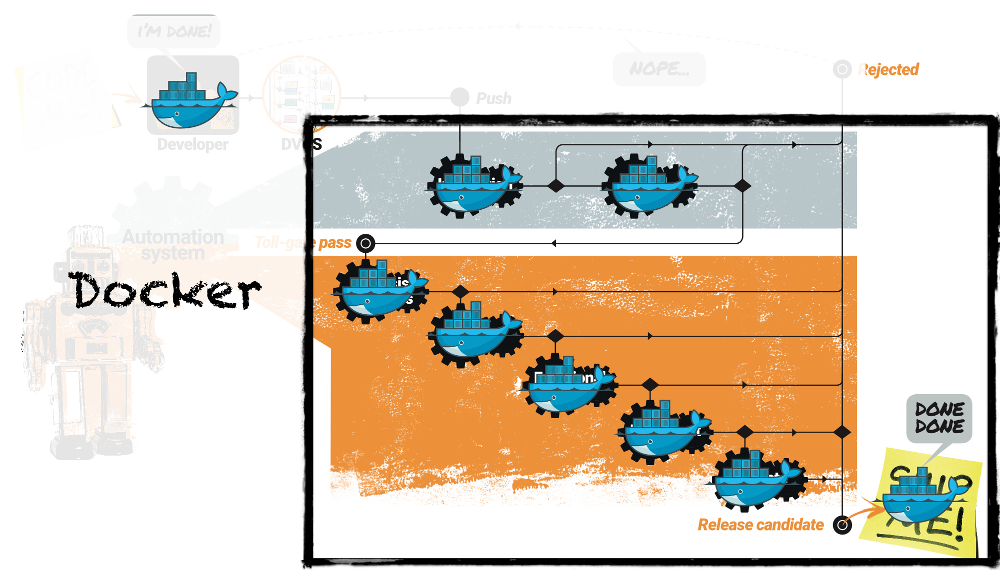
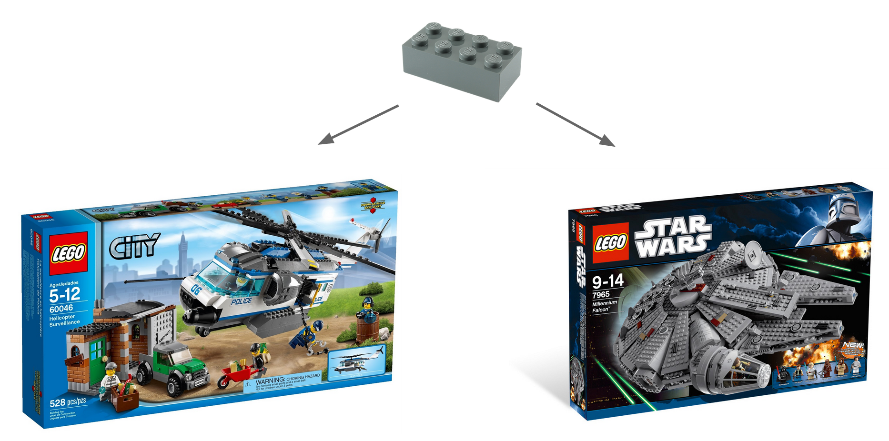
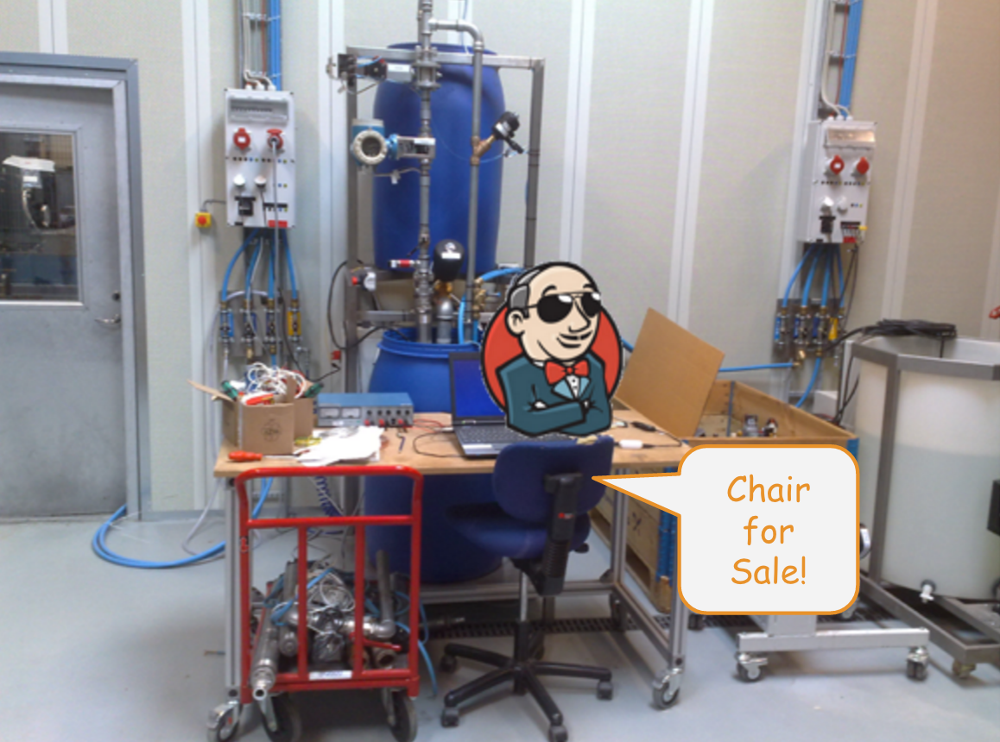

# Introduction to Continuous Delivery
>>>>NEWSECTION
##Who is Praqma?
Continuous Delivery & DevOps experts and evangelists

Tools & Automation experts. We help customers with practical implementation of their development process.

8 years, 33 employees, offices in Copenhagen, Aarhus, Oslo & Stockholm

A ton of events and over 10 conferences a year. [code-conf.com](http://www.code-conf.com)

>>>>NEWSLIDE
## Partners
<!-- .element: class="plain small" --><!-- .element: class="plain small" --><!-- .element: class="plain small" --><!-- .element: class="plain small" -->
## Clients
<!-- .element: class="plain small" --><!-- .element: class="plain small" --><!-- .element: class="plain small" --><!-- .element: class="plain small" -->

>>>>NEWSLIDE
###We don't chop wood - we sharpen axes!
<!-- .element: class="plain large" -->

>>>>NEWSLIDE
##Know your tools, practice your knife skills
<!-- .element: class="plain max" -->

>>>>NEWSECTION
# Continuous Delivery in a nutshell
- what does it take to do continous delivery
- Never only technical
- Never only proccess

>>>>NEWSECTION
#Agile manifesto
### *"Our highest priority is to satisfy the customer through early and continuous delivery of valuable software."*
### *"Working software is the primary measure of progress."*

Note:

Do my changes work:

  * on someone else's machine?
  * with everyone else's changes?
  * on all platforms?

>>>>NEWSLIDE

### *"Deliver working software frequently, from a couple of weeks to a couple of months, with a preference to the shorter timescale."*

Note:
Can my software:

  * Build itself?
  * Test itself?
  * Deploy itself?

>>>>NEWSLIDE

### *"Simplicity -- the art of maximizing the amount of work not done -- is essential."*

Note:
Is my team:

  * Automating repetitive manual work?
  * Discovering errors quickly?
  * Avoiding rework?

>>>>NEWSECTION

# The CoDe Journey

>>>>NEWSLIDE

<!-- .slide: data-transition="slide-in fade-out" -->

<!-- .element: class="plain max" -->

### Software as a factory

Note:

Back to our own world of coding.

We're using a term "Software as a Factory" to create the understanding that software, like the assembly belt on a factory floor, is dependent on a series of related processes, that needs to be carefully designed to each one of them deliver their tiny contribution to the overall product, and each station must do that "at the beat of the drum".

Optimizing a software development process is like optimizing a production plant factory floor that is why LEAN, TPS, Six Sigma, TQM, Production lines are the fathers of the Agile thinking.  We look at our customers software organizations through this lens, looking for queues, wait states, rework and of course automation opportunities.

>>>>NEWSLIDE

<!-- .slide: data-transition="fade-in fade-out" -->
<!-- .element: class="plain max" -->

### Am I doing the right thing?

Note:

So as we investigate the factory, we begin by asking how people choose what to work on.

>>>>NEWSLIDE

<!-- .slide: data-transition="fade-in fade-out" -->
<!-- .element: class="plain max" -->

### Am I doing it right?

Note:

Then we go on to look at how each team member can qualify their work.

>>>>NEWSLIDE
<!-- .slide: data-transition="fade-in fade-out" -->
<!-- .element: class="plain max" -->

### We meet on master

Note:

The next stage is to look at collaboration and integration practices.  Here we have yet another metaphor, the release-train branching strategy.

>>>>NEWSLIDE

<!-- .slide: data-transition="fade-in fade-out" -->
<!-- .element: class="plain max" -->

### Automate everything

Note:

Then we begin to look at the manual processes and gatepoints in the factory, and seek opportunities for automation.

>>>>NEWSLIDE

<!-- .slide: data-transition="fade-in slide-out" -->

<!-- .element: class="plain max" -->

### What we develop, test, deploy and ship is the same

Note:

Finally, we look for opportunities to create consistency and reliability in the factory.

>>>>NEWSLIDE

## Everything "as Code"

Infrastructure, test, software verification, web, graphical design, documentation, slide decks

_...lunch, marketing, conferences_<!-- .element: class="fragment" -->

Note:

Codes has some desirable characteristics that makes it desirable for use for things that behave like code.

- It's strict
- It's syntax can be checked
- It can be persisted in files, and version controlled
- It can be executed
- ...over and over again, to produce the exact same result
- It can be copied and shared
- Configuration can easily be separated for the internal logic
- It can be broken down to smaller components
- ...each with a clear definition of done
- It can be automatically verified in a pipeline

That why we want anything and everything as code:

Infrastructure, test, web, graphical deign, documentation.

>>>>NEWSLIDE
<!-- .element: class="plain max" -->

## Lego

Note:

In Continuous Delivery we need - well deliveries.

An essential ingredient in the CoDe stew is _breaking down the monolith_ into smaller manageable individually releasable components, each with it's own clear definition of done that can be treated as inventory and used by anyone who acknowledges the interface.

This is of course true for all code - even your Jenkins plugins, your maintenance scripts and your Docker containers...

But the perfect metaphor for this is of course Lego blocks - or if we want to give our neighbors som credit too; IKEA furnitures.

Each lego block or has is own clear interface, it's own definiton of done and when quality measures are met, it becomes inventory and dependencies are managed simply by checking that all pieces are there.

Perfect

>>>>NEWSECTION
##Grundfos
<!-- .element: class="plain max" -->

Note:
Warstories
- Xethru might be a cool example
- How do we test real physical things ( Volvo/Grundfos hardware )
- Tie this warstories to how we help customers

