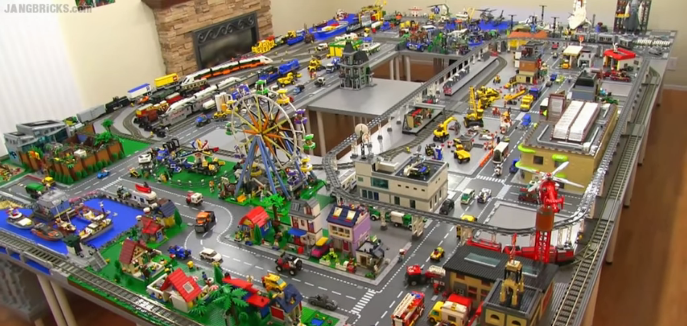
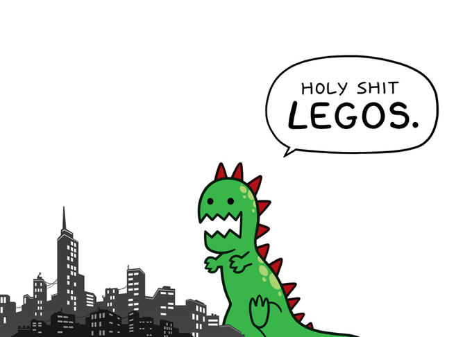

# Lego Scrum

>>>>NEWSECTION
## Intro

* Make a city in sprints
* One from Praqma is the PO
* Each city has a joint backlog
* Sprint - Delivery - Retrospective

>>>>NEWSECTION
## Organize yourself

* Each city has three construction teams
* Each team consist of 4-8 people (the larger the harder)
* Each team needs **a name**!
* Each team needs **a team lead**!

>>>>NEWSECTION
## Rules

* You are allowed to use anything else than LEGO as well
* PO is the one accepting your deliveries, *so ask*
* Sprints are fixed time, **be on time**

>>>>NEWSECTION
## What is there in a city?

Make sugestions for what is in a city e.g.
* One story house
* Two story house
* Park

>>>>NEWSECTION
## setup

* small post-it's
* **BIG** post-it's
* A bag of LEGO for each construction team

>>>>NEWSECTION
# Let the game begin!

