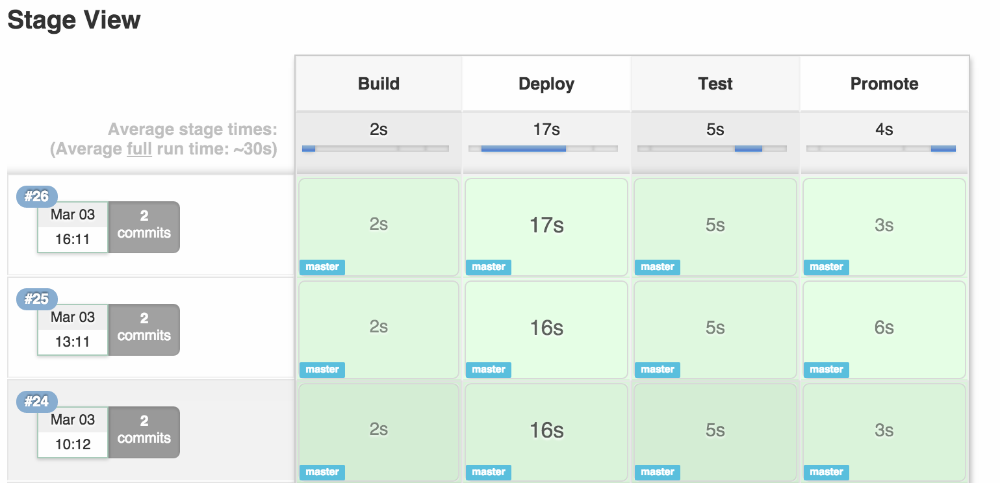
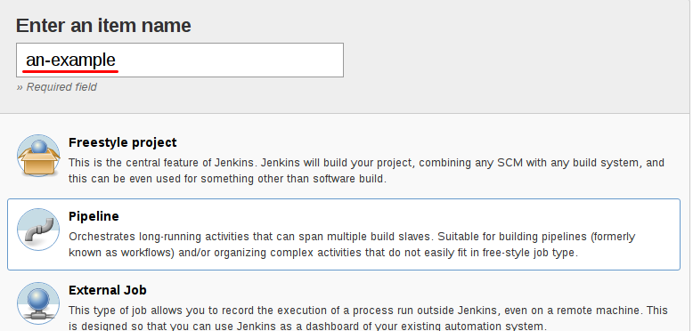
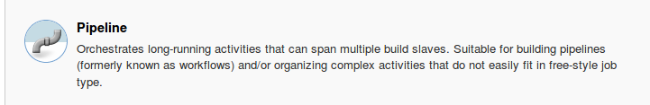

# Jenkins Pipelines
<!-- .element height="30%" width="30%" -->


>>>>NEWSECTION
## Introducing Pipelines
No more pointy pointy, cliky cliky


>>>>NEWSLIDE
## Motivations for pipelines as code

* Retain history of all changes to Pipeline
* Rollback to a previous Pipeline version
* View diffs and merge changes to the Pipeline
* Test new Pipeline steps in branches
* Run the same Pipeline on a different Jenkins server


>>>>NEWSLIDE
## Jenkins Pipeline
[Jenkins Pipeline](https://jenkins.io/doc/book/pipeline/) is a suite of plugins which supports implementing and integrating continuous delivery pipelines in Jenkins.


>>>>NEWSLIDE
## Two Syntax Options

* Scripted Pipelines
  * Original
  * Flexibility and extensibility
  * Steep learning curve
* Declarative:
  * Simpler and more opinionated
  * Stricter structure
  * Requires less groovy knowledge

**Today we will use declarative syntax**


>>>>NEWSLIDE
## Declarative Jenkinsfile

```
pipeline {
    agent any
    stages {
        stage ('Hello'){
            steps{
                sh "echo 'Hello World'"
            }
        }
    }
}
```


>>>>NEWSLIDE
## Vocabulary

* Agent (By label, docker, ++)
* Stage (describes a stage of this Pipeline)
* Steps (describes the steps to be run in this stage)

>>>>NEWSLIDE
## The stages of the pipeline


>>>>NEWSLIDE
## Declarative Jenkinsfile
Several stages
```
pipeline {
    agent any

    stages {
        stage('Build') {
            steps {
                echo 'Building..'
            }
        }
        stage('Test') {
            steps {
                echo 'Testing..'
            }
        }
        stage('Deploy') {
            steps {
                echo 'Deploying....'
            }
        }
    }
}
```


>>>>NEWSECTION
# Your first pipeline

>>>>NEWSLIDE
## Exercise: Create a pipeline job in Jenkins.

```
pipeline {
    agent any
    stages {
        stage ('Hello'){
            steps{
                sh "echo 'Hello World'"
            }
        }
    }
}
```
Give it a good name and select the 'pipeline' type.
[Getting Started](https://jenkins.io/doc/book/pipeline/getting-started/) provides nice help for those new to this.


>>>>NEWSLIDE
## Additional methods:
- Archiving

```
// archiving the jar files in the target folder
archiveArtifacts 'target/*.jar'

```

>>>>NEWSLIDE
## Exercise: make your first pipeline
Do exercise **5,6,7** in the [Embedded Project repository](https://github.com/praqma-training/embeddedproject).


>>>>NEWSECTION
## Multibranch pipelines

>>>>NEWSLIDE
Two job-types for pipelines

- Pipeline



- Multi-branch Pipeline


>>>>NEWSLIDE

##Exercise 8 - Multibranch pipelines

Creates a set of Pipeline projects according to detected branches in one SCM repository.

So every branch on your remote becomes a pipeline. Just push and it will be triggered!

* [9](https://github.com/praqma-training/jenkins-workshop#9-multibranch-pipeline)


>>>>NEWSECTION

# Docker and Jenkins

>>>>NEWSLIDE
## Simple docker

```
pipeline {
    agent {
        docker { image 'node:7-alpine' }
    }
    ...
}
```

>>>>NEWSLIDE
## Docker with arguments

```
pipeline {
    agent {
        docker {
            image 'maven:3-alpine'
            args '-v $HOME/.m2:/root/.m2'
        }
    }
    ...
}
```

>>>>NEWSLIDE

##Exercises 9 - Dockerized builds

* [Exercise 9](https://github.com/praqma-training/embeddedproject#exercise-9---run-your-build-in-a-defined-environment)
