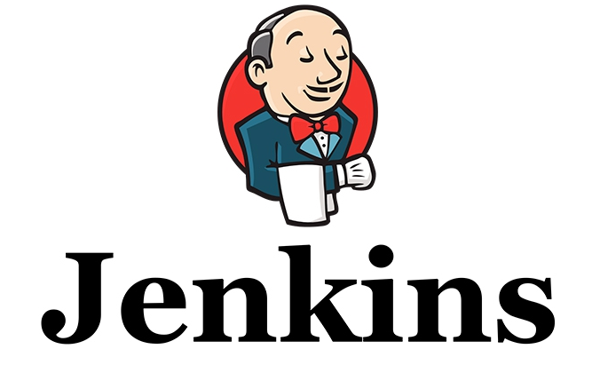

# Hello, Jenkins World!

>>>>NEWSLIDE
## Contents

* Build automation: _What is CI?_
* Hello, Jenkins World!
* CI: Fetching and building code

>>>>NEWSECTION

## Beginnings

* *"It works on my machine"*
* Environment differences
* Repetitive, manual work

>>>>NEWSLIDE
> "Our highest priority is to satisfy the customer
through early and continuous delivery
of valuable software."

## Why use a continuous integration server?

>>>>NEWSLIDE

> " Working software is the primary measure of progress. "

## Do my changes work:

  * On someone else's machine?
  * With everyone else's changes?
  * On all platforms?

>>>>NEWSLIDE

> "Deliver working software frequently, from a
couple of weeks to a couple of months, with a
preference to the shorter timescale."

## Does my software:

  * Build itself?
  * Test itself?
  * Deploy itself?

>>>>NEWSLIDE

> Simplicity--the art of maximizing the amount
of work not done--is essential.

## Is my team:

  * Automating repetitive manual work?
  * Discovering errors quickly?
  * Avoiding rework?

>>>>NEWSLIDE

## So, an automation platform helps us:

 * Ensure our software is working
 * Increase our development efficiency
 * Work in teams
 * Have a single source of truth
 * Shorten the feedback loop

Not bad, eh?

>>>>NEWSLIDE

Note:  Let's talk about the difference between CI and CoDe

>>>>NEWSLIDE

##  We have options!

>>>>NEWSLIDE

## But today we choose jenkins!

>>>>NEWSECTION
# Hello, Jenkins World!

>>>>NEWSLIDE
## Terminology
* Job
* Build
* Master / nodes
* Schedule
* Pipeline
* Plugins
* Jenkinsfile (Build_as_code)

>>>>NEWSLIDE
## Terminology explained

The Jenkins *master* is an advanced *scheduler* that on basis of *Job definitions* monitor and executes *builds* on *nodes*.
A *job* can be defined in many ways, as *Standard job*, through *JobDSL* or through the new *Jenkins Pipeline*.

>>>>NEWSLIDE
## Workflow of standard jobs

>>>>NEWSLIDE
## Pipelines

>>>>NEWSLIDE

>>>>NEWSLIDE
## Architecture - Logical

>>>>NEWSLIDE
## Architecture - Physical

>>>>NEWSECTION
## Inside Jenkins

>>>>NEWSLIDE
## Jenkins UI

>>>>NEWSECTION
# Continuous Integration

### Is my code good enough to share with my team?

>>>>NEWSLIDE
## Demo - A first build project
We have installed a jenkins instance here:

  `http://embedded.praqma.com`

>>>>NEWSLIDE

## CI is:

* Fetch
* Integrate
* Run tests

Not doing CI just yet, only building for today.

>>>>NEWSLIDE
## A Job is an atomic unit of automation work

>>>>NEWSLIDE

## Exercise 1-4: Build and test with Make

    # Fork github project
    # Create new freestyle job on jenkins http://embedded.praqma.com:8080
    # Create a new freestyle job to build your fork

>>>>NEWSECTION
## Cheat sheet

>>>>NEWSLIDE

>>>>NEWSLIDE

>>>>NEWSLIDE

>>>>NEWSLIDE

