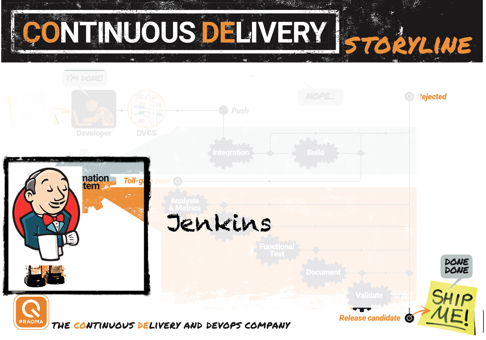
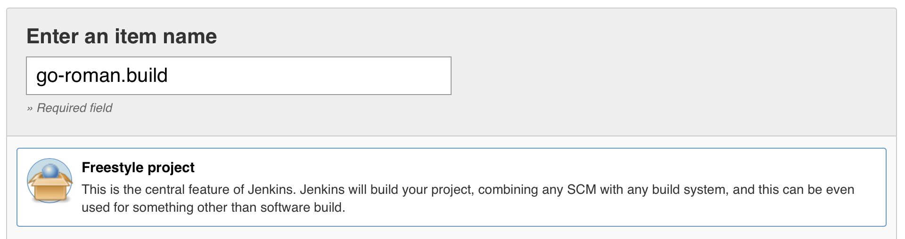

## The journey

 * Continuous Delivery in a nutshell
 * Infrastructure as code
   * Set up a multi-application development stack (Jenkins, Artifactory and Docker)
 * Set up a full build pipeline (as code)
   * Perform automated builds, run regression tests and automatically deploy
 * The release train branching strategy
   * Pre-tested integration

>>>>NEWSLIDE

## The hands-on approach

Every step is divided into three sections:

 - Teaching: explain the concepts we will implement
 - Demo: a quick tour of how to implement
 - Exercise: your turn to get your hands dirty


>>>>NEWSECTION
# Continuous Delivery in a nutshell

>>>>NEWSLIDE

### *"Our highest priority is to satisfy the customer through early and continuous delivery of valuable software."*


>>>>NEWSLIDE

### *"Working software is the primary measure of progress."*

Note:

Do my changes work:

  * on someone else's machine?
  * with everyone else's changes?
  * on all platforms?


>>>>NEWSLIDE

### *"Deliver working software frequently, from a couple of weeks to a couple of months, with a preference to the shorter timescale."*

Note:
Can my software:

  * Build itself?
  * Test itself?
  * Deploy itself?


>>>>NEWSLIDE

### *"Simplicity -- the art of maximizing the amount of work not done -- is essential."*

Note:
Is my team:

  * Automating repetitive manual work?
  * Discovering errors quickly?
  * Avoiding rework?


>>>>NEWSLIDE

## What if there was a way to automatically ensure our software is working while increasing our development efficiency?

>>>>NEWSLIDE


Note:  
- [ ] Explain all the steps in the story line
- [ ] Talk about the difference between CI and CoDe (grey vs orange)
- [ ] Explain that all these things happen for any sw
- [ ] So might as well automate it
- [ ] Talk about praqma/novelda/telenor

>>>>NEWSLIDE


>>>>NEWSLIDE


>>>>NEWSLIDE


>>>>NEWSLIDE


>>>>NEWSLIDE


>>>>NEWSLIDE


>>>>NEWSLIDE

<!-- .element: class="plain small" -->

### The web service all the world is waiting for!
https://github.com/praqma-training/gowebserver

>>>>NEWSLIDE

## Demo


>>>>NEWSLIDE

## Exercise 1!

Follow the Exercise 1 instructions here to create your own fork of gowebserver...

### https://github.com/praqma-training/codeascode


>>>>NEWSECTION

# Infrastructure as code

>>>>NEWSLIDE

##  So for both CI and CoDe...we need an automation platform!

>>>>NEWSLIDE

##  We have options!


>>>>NEWSLIDE

## But today we choose jenkins...


>>>>NEWSLIDE

## Why Programmable Infrastructure?

- It's strict
- It's syntax can be checked
- It can be persisted in files, and version controlled
- It can be executed
- ...over and over again, to produce the exact same result
- It can be copied and shared
- Configuration can easily be separated for the internal logic
- It can be broken down to smaller components
- ...each with a clear definition of done
- It can be automatically verified in a pipeline


>>>>NEWSLIDE

## Everything "as Code"

Infrastructure, test, software verification, web, graphical design, documentation, slide decks

_...lunch, marketing, conferences_<!-- .element: class="fragment" -->

Note:

Codes has some desirable characteristics that makes it desirable for use for things that behave like code.

That why we want anything and everything as code:

Infrastructure, test, web, graphical deign, documentation.

>>>>NEWSLIDE

## Demo - eyes up!

    # Show the system

>>>>NEWSLIDE


>>>>NEWSLIDE

## Exercise 2!

Follow the Exercise 2 instructions here to set up your own automation platform...

### https://github.com/praqma-training/codeascode


>>>>NEWSECTION
# Continuous Delivery

## Our first pipeline...

>>>>NEWSLIDE
## Let's have an adventure!

<!-- .element: class="plain small" -->

>>>>NEWSLIDE

## CI is:

* Fetch
* Integrate
* Run tests

>>>>NEWSLIDE

# Demo

>>>>NEWSLIDE
## A Job is an atomic unit of automation work


>>>>NEWSLIDE


>>>>NEWSLIDE


>>>>NEWSLIDE


>>>>NEWSLIDE


Note:
Here we want to show:

  * Build job
  * Workspac

>>>>NEWSLIDE


>>>>NEWSLIDE
# Ok, let's actually do a test

>>>>NEWSLIDE


>>>>NEWSLIDE
# But can it fail?

## Make it go red...
## Make it go blue...

>>>>NEWSLIDE


>>>>NEWSLIDE

# Exercise 3.1

### [Follow the instructions for exercise 3.1](https://github.com/praqma-training/codeascode/blob/master/journey-exercises/Exercise3.md#31-configure-a-simple-build-job)

>>>>NEWSLIDE

## Extending the pipeline with tests

<!-- .element: class="plain large" -->

>>>>NEWSLIDE

## Great artists steal

<!-- .element: class="plain max" -->

>>>>NEWSLIDE

<!-- .element: class="plain large" -->

>>>>NEWSLIDE

<!-- .element: class="plain medium" -->

>>>>NEWSLIDE

<!-- .element: class="plain max" -->

>>>>NEWSLIDE

### Tadaaa!!
<!-- .element: class="plain max" -->

>>>>NEWSLIDE

# Exercise 3.2

### [Follow the instructions for exercise 3.2](https://github.com/praqma-training/codeascode/blob/master/journey-exercises/Exercise3.md#32-set-up-a-test-job)

>>>>NEWSECTION

# Jenkins as code
### No more pointy-pointy, clicky-clicky!

<!-- .element: class="plain small" -->
>>>>NEWSLIDE

## Jenkins JobDSL

- Plugin to allow jobs-as-code
- Hack-turned-tool, from the folks at Netflix
- Greatly simplifies the maintenance of large Jenkins deployments
- Puts the power in the hands of the team

>>>>NEWSLIDE

## A simple job definition

````
def project = 'quidryan/aws-sdk-test'
def branchApi = new URL("https://api.github.com/repos/${project}/branches")
def branches = new groovy.json.JsonSlurper().parse(branchApi.newReader())
branches.each {
    def branchName = it.name
    def jobName = "${project}-${branchName}".replaceAll('/','-')
    job(jobName) {
        scm {
            git("git://github.com/${project}.git", branchName)
        }
        steps {
            maven("test -Dproject.name=${project}/${branchName}")
        }
    }
}
````
>>>>NEWSLIDE

## Key points:

 - Groovy-based
 - Use a "seed job" to run the jobDSL's
 - Can be versioned together with the code
 - There is a great [wiki](https://github.com/jenkinsci/job-dsl-plugin/wiki) and [API Viewer](https://jenkinsci.github.io/job-dsl-plugin/)


>>>>NEWSLIDE

## Demo - go-roman jobDSL

>>>>NEWSLIDE

## Exercise 4!
### [Jenkins jobs as code](https://github.com/praqma-training/codeascode/blob/master/journey-exercises/Exercise4.md)

>>>>NEWSECTION

# The release train branching strategy

>>>>NEWSLIDE

# Pre-tested Integration


>>>>NEWSLIDE

## Exercise 5!
### [Set up pre-tested integration for deliver branches](https://github.com/praqma-training/codeascode/blob/master/journey-exercises/Exercise5.md)


>>>>NEWSECTION

# Everything "as code"

Infrastructure, test, software verification, web, graphical design, documentation, slide decks

_...lunch, marketing, conferences_<!-- .element: class="fragment" -->

>>>>NEWSLIDE

## Exercise 6
### [Extra credit!](https://github.com/praqma-training/codeascode/blob/master/journey-exercises/Exercise6.md)
