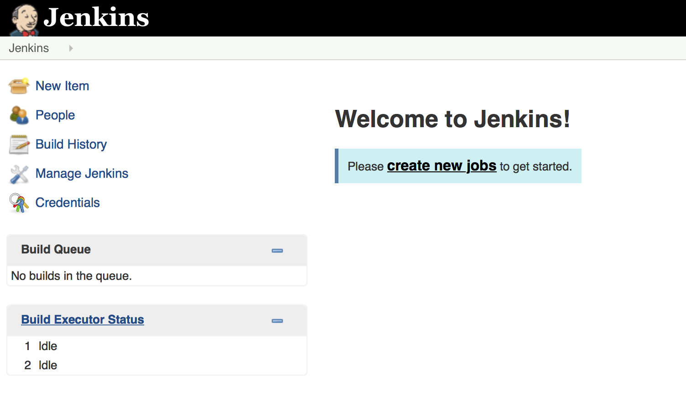

## The journey

 * Continuous Delivery in a nutshell
 * Infrastructure as code
   * Set up a multi-application development stack (Jenkins, Artifactory and Docker)
 * Set up a full build pipeline (as code)
   * Perform automated builds, run regression tests and automatically deploy
 * The release train branching strategy
   * Pre-tested integration

>>>>NEWSECTION
# Continuous Delivery in a nutshell

>>>>NEWSLIDE

### *"Our highest priority is to satisfy the customer through early and continuous delivery of valuable software."*

>>>>NEWSLIDE

### *"Working software is the primary measure of progress."*

Note:

Do my changes work:

  * on someone else's machine?
  * with everyone else's changes?
  * on all platforms?

>>>>NEWSLIDE

### *"Deliver working software frequently, from a couple of weeks to a couple of months, with a preference to the shorter timescale."*

Note:
Can my software:

  * Build itself?
  * Test itself?
  * Deploy itself?

>>>>NEWSLIDE

### *"Simplicity -- the art of maximizing the amount of work not done -- is essential."*

Note:
Is my team:

  * Automating repetitive manual work?
  * Discovering errors quickly?
  * Avoiding rework?

>>>>NEWSLIDE

## What if there was a way to automatically ensure our software is working while increasing our development efficiency?

>>>>NEWSLIDE

Note:  
- [ ] Explain all the steps in the story line
- [ ] Talk about the difference between CI and CoDe (grey vs orange)
- [ ] Explain that all these things happen for any sw
- [ ] So might as well automate it
- [ ] Talk about praqma/novelda/telenor

>>>>NEWSLIDE

>>>>NEWSLIDE

>>>>NEWSLIDE

>>>>NEWSLIDE

>>>>NEWSLIDE

>>>>NEWSLIDE

>>>>NEWSECTION

# Infrastructure as code

>>>>NEWSLIDE

##  So for both CI and CoDe...we need an automation platform!

>>>>NEWSLIDE

##  We have options!

>>>>NEWSLIDE

## But today we choose jenkins!

>>>>NEWSLIDE

## Demo - eyes up!

    # Show the system

>>>>NEWSLIDE

Why? Code has special properties...you can:

 * Version it
 * Branch it
 * Run it
 * Duplicate it
 * Review it

>>>>NEWSLIDE

>>>>NEWSECTION
# Continuous Delivery

## Our first pipeline...

>>>>NEWSLIDE
## Let's "build" adventure time!

>>>>NEWSLIDE

## CI is:

* Fetch
* Integrate
* Run tests

>>>>NEWSLIDE
## A Job is an atomic unit of automation work

>>>>NEWSLIDE

>>>>NEWSLIDE

>>>>NEWSLIDE

Note:
Here we want to show:

  * Build job
  * Workspac

>>>>NEWSLIDE

>>>>NEWSLIDE
# Ok, let's actually do a test

>>>>NEWSLIDE

>>>>NEWSLIDE
# But can it fail?
## Now is the time to create your own fork...

>>>>NEWSLIDE

>>>>NEWSLIDE

>>>>NEWSLIDE

## Remember to update the job urls!

>>>>NEWSLIDE

>>>>NEWSLIDE

## Task 1: make the build pass again
## Task 2: make the build run automatically

>>>>NEWSECTION

# Pre-tested Integration

>>>>NEWSLIDE

### 1. Install plugin
### 2. Configure pre-tested integration
### 3. Push good change to deliver and see it merge
### 4. Push bad change to deliver and see it rejected

>>>>NEWSECTION

# CoDe: Testing and evaluating code

>>>>NEWSLIDE
### 1. Set up verification job
### 2. Set build job to trigger it
### 3. "Deploy" the artifact

>>>>NEWSECTION

# Everything as code

>>>>NEWSLIDE

### 1. Create jobDSL for jobs
### 2. Create seedjob
### 3. Remove manually created jobs
