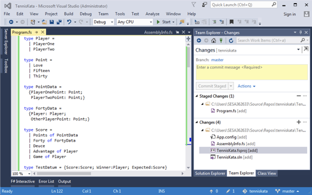

# GitHub for Everyone
## Collaborating through GitHub
Jan Krag & Sofus Albertsen

Note: 

## Set-Up

* Use githubteacher to create an everyone-month-year repo.
* Make sure you have access to the add-collaborator script.
* Optional: Have Side-by-Side Menu which includes upcoming commands.
* Create a scratch directory for cloning your work down.
* Clear out your GitHub Desktop for relevancy.

>>>>NEWSLIDE
## Who are we?
### Jan Krag

Continuous Improvement Agent

Note:
We work for Praqma, a consultancy company focusing on helping customers implement CoDe
                  
>>>>NEWSLIDE
## Who are we?
### Sofus Albertsen

Consultant & trainer

>>>>NEWSLIDE
## Who are you?

>>>>NEWSECTION
## Roadmap
* Introduction to GitHub
* The GitHub Flow
* Social features of GitHub
* Pull requests
* Using GitHub locally
* Advanced commits
* Managing Projects on GitHub

>>>>NEWSECTION
# Introduction to GitHub

>>>>NEWSLIDE
## Quick intro
What is ...

Git?

GitHub?

A repository?

Note:
* Git is technology used to version files.
  * Git manages versions and allows for easy comparison/rollback/etc.
* GitHub is a collaboration platform built around Git
  * Big community, very popular, lots of successful open source projects
* The repository is the entity around which collaboration happens
  * It's the file store for a single project or component, etc.
  * Work, discussions and file changes happen in the scope of a repository

>>>>NEWSLIDE
## Exploring a repository
Visit [github.com/Praqma/praqma.com](https://github.com/Praqma/praqma.com)

Note:
* Visit the [praqma.com](https://github.com/Praqma/praqma.com) repo
* `Code` 
  * repository bulk, where you keep all your files and data
* `README.md` 
  * 'Markdown' file rendered on the main page by default
  * Make sure you hand out MD cheat sheets 
* `Issues` 
  * The heart of collaboration & communication, where you manage work/report problems, etc.
* `Projects` 
  * A means to organize/plan your issues 
* `Pull Request` 
  * Pull requests are for proposing changes to the repo, owners can merge them in
* `Wiki` 
  * A place to hold documentation for your repo
* `Pulse` and `Graphs` 
  * Dashboards and useful data of your project
* `Settings` 
  * You don't see this unless you're an owner or admin  

>>>>NEWSECTION
## Setup
* Log in to [github.com](github.com)
* Visit [github.com/praqma-training/everyone-sdfe-12-2016](github.com/praqma-training/everyone-sdfe-12-2016)
* Head over to **Issues**
* Comment on the issue thread!
                           
Note:
* Head over to the training repo and comment on issue #1.
* Anyone can create issues and comment on existing ones.
* But you have to be a collaborator to make any changes to the repository.
* Comment on the issue and we'll add you as a collaborator.
* **SETUP:** Add everyone as collaborators by running add-collaborators script
 
>>>>NEWSLIDE
## You've got mail!

Now is a good time to talk about:
* Thread subscription
* Repository watching

Note:
* Now that you've all gotten a bunch of emails, let's talk about controlling notifications
* GitHub sends you notifications of:
  * Issue threads you're subscribed to
  * Repositories you're watching
  * By default, you watch repositories you join (changed in profile settings)
* You can unsubscribe from issue threads
* You can unwatch repositories
* Notification settings
* Notification center (Web icon)
* **DEMO:** Unwatch and unsubscribe from thread/repositories
* **DEMO:** Change notification settings in GitHub profile

>>>>NEWSECTION 
## Go with the flow

## **[The GitHub Flow](https://guides.github.com/introduction/flow/)**

Note:
* Before we really start working, let us propose a nice workflow
* Workflow promoted by GitHub themselves
* Let's take a quick peek
* **DEMO:** Go through GH Flow
* It focuses on tying your work to issues and promotes discussion of the changes you're making
* Let's do some work following this flow

>>>>NEWSECTION
# Issues

### DEMO: Using Issues

### Lab: Create your own issue 
Create an issue reminding you to add your bio

Note:
DEMO: Using Issues
* Create issue for "Add me as a collaborator!"
* Discuss Permissions
  * If you aren't a collaborator, on a public repo you may add a comment to an issue, or create an issue of your own.
  * You can't create branches, PRs, merge PRs.
* @mention any co-teachers who will run the script on their computer from https://github.com/github/training-utils
  * make sure you have a GITHUBTEACHER_TOKEN saved for the repo you are using for every teacher/co-teacher
  * make sure to run the script e.g. add-collaborators -r praqmatrainer/everyone-12-2016 -i 1

--------------------------------------
>>>>NEWSLIDE
## Demo: Working with issues

Note:
In this section we are only crating the issue!
 - Title: Create a new file for username hometown
  - Content: 
    - Add file for your hometown
    - Include Steps (Create a branch, add file, create a commit, open a PR, have a discussion about PR, merge PR)
  - Demonstrate markdown for headers, checkboxes and emoji
    - Toolbar
    - `Preview`
  - `Assign` the issue to the teacher
  - Add a `label`

>>>>NEWSLIDE
- **LAB:** Create an similar Issue to add your bio to the repo
Add a checklist like:

  - Create a branch
  - add file
  - create a commit
  - open a PR
  - have a discussion about PR
  - merge PR

>>>>NEWSECTION
# Pull requests

>>>>NEWSLIDE
### Creating Your First Pull Request
- Using Branches

Note:
- Using Branches
  - Briefly discuss "Git Status" toolbar (commits, branches, releases, contributors)
  - **DEMO:** Creating a Branch
    - Create a branch named `githubhandle-hometown`
  - **LAB:** Learners create their own branch
  - Notice what happens when you refresh the page/click on the main repo!
>>>>NEWSLIDE
## Creating Files on GitHub
Note: 

* **DEMO:** Create a file on GitHub
  * Name the file `handle-hometown.md`
  * Demo creating a folder.
  * Add Places to Eat/Places to Go/Places to Avoid/Fun Facts
  * Commit the file to the branch
    * Creates a safe rollback point for us.
    * Allows us to see our repo at a specific point in time.
    * "Oops Button"

>>>>NEWSLIDE
## LAB: Create your own location guide
- Create a USERNAME-LOCATION.md file
- Add your own recommendations
- Commit the file to your branch

Note:
* **LAB:** Learner creates a location-recommendation file and commits it to their branch

>>>>NEWSLIDE

## Creating Pull Requests
### Demo

Note:
  - Understanding Pull Requests
  - **DEMO:** Creating a Pull Request on GitHub
    - Show `base:` and `compare:` drop downs
    - Issue resolution (Resolves/Closes #issuefrombefore)
    - Assignment, Label
    - Create PR

>>>>NEWSLIDE
## LAB: 
### Create your own Pull Request

Note:
- **LAB:** Learner creates a pull request
    - Return to original issue and hover over information pane
    - Summarize where we've been.

>>>>NEWSLIDE

## Pull Request Tools
* `Conversation` view
* `Commits` view
* `Files changed` view
* Create line comment
* Add a general comment to the discussion
* Add :+1: emoji

>>>>NEWSLIDE    
## LAB 
### Comment on someone else's pull request
Try the :+1: emoji and other emoji's

Try to create an inline comment

>>>>NEWSLIDE

## Editing Pull Request Files
 - Demo
 - Lab

Note:
- Editing Pull Request Files
  - **DEMO:** Edit the file based on the pull request comments
   - Edit and commit the file changes
   - Show the `Commits` tab
  - **LAB:** Learner edits their file based on comments in the pull request

>>>>NEWSLIDE

## Merging Pull Requests
- Demo
- Lab

Note:
- Merging Pull Requests
  - What happens when we merge Pull Requests
    - Rule: Only merge your own pull request. Add :ship: to someone else's PR as example.
  - **DEMO:** Merge the pull request, closing the issue in the merge commit
    - Discuss merge dropdown. Squash/Merge vs. default merge. 
      - A squash merge deletes commit history. 
    - Merge attempt failed. 
      - "Every time someone merges, GitHub checks for conflicts. If it doesn't have time to make the checks because of the amount of merges, it'll give us a 'Merge Attempt Failed' dialog." 
    - Delete the branch
    - Discuss "Revert"
    - Show the closed issue
    
  - **LAB:** Learner merges their pull request, closes the issue, and deletes the branch

>>>>NEWSECTION 
## A quick recap

* Git(Hub)
* Repositories
* Collaborators
* Notifications
* Issues
* Commits
* Pull Requests
       
    
Note:
* GitHub is a collaboration platform around Git
* Git is a versioning control system used for managing file versions
* Repositories are the heart of a project, they hold the files and are the scope of issues
* Issues are discussion threads for problems/tasks to work on
* Notifications are eager to give you updates on issues, but don't get flooded by them!

>>>>NEWSLIDE                                                                           
## A quick recap - The Work_flow_

* Open an issue
* Branch off
* Do some work
* Collaborate
* Merge

The [GitHub Flow](https://guides.github.com/introduction/flow/)

Note:
* Go over [the GitHub Flow](https://guides.github.com/introduction/flow/)** again

>>>>NEWSECTION
### Working locally
In this section, you will:

 - Create a new repository
 - Work with your repository on your local machine
 - Convert your repository into a website
 - Host and share your website

>>>>NEWSLIDE
# GitHub Desktop

 [https://desktop.github.com/](https://desktop.github.com/)

Note:
- Why Use GitHub Desktop?
  - Everything is the same, except that you can't update multiple files in the same commit.
  - Git is super lightweight and you can work locally complete separate from your remote, and offline, with the entire history.
  - Everyone has a back-up at all times. DVCS. 

>>>>NEWSLIDE
## Intro to Desktop
* Install
* Basic configuarion
* Cloning a Repository

Note:
  - Show Tutorial Repo (Encourage them to do this later.)
  - Ensure we are logged in.
    - GitHub Desktop Preferences
    - Accounts
    - Login
      - Don't use @github.com, username will work just fine. 
      - Reiterate. This is not a constant connection. It will only do so when we tell it to. 
      - Update Advanced config information. 
      
- Basic GitHub Desktop Configuration
  - Git Configuration Levels
  - **DEMO + ACTIVITY:** Set basic config

>>>>NEWSLIDE
## Lab
* Download and install [GitHub Desktop](https://desktop.github.com/).
* Open GitHub Desktop.
* Follow the prompts to sign in to your account.
* Configure your user information 
  * (this only happens the first time you run the application).

>>>>NEWSLIDE
### The benefits of working locally with Git:

* Include changes to more than one file in a single commit
* Work on your project while disconnected from the internet
* Run local builds and tests on your project
 
### The benefits of GitHub Desktop:

* Remove complexity when working with Git locally
* View your project’s history
* Sync your repository with GitHub
* Create Pull Requests locally

>>>>NEWSLIDE

### Cloning a Repository
* Demo
  - Add vs. Create vs. Clone
* Lab
  - clone the repo
  - switche to your branch 

Note:
  - Why we clone
    - Add assumes that you have a local repo and want to look at it using GH Desktop.
    - Create assumes you want to create a repo on your local machine.
    - Clone looks at all of the repos that we have access to. Filter to find the repo that we're looking for.
  - **DEMO:** Clone the repository
    - Click through and demo all changes on visualization tool.
    - Go over "Sync". Makes sure what we're working on is the most recent version.
    - Shows user, time, commit ID, revert, etc.
    - Introduce what we're doing. Return to GitHub flow diagram. Begin again.
    - Create branch on Desktop called `githubteacher-desktop`
      - Typically branch from master.

>>>>NEWSLIDE
### Editing Local Files
* Working in Atom or other editors

_You can't use Desktop to edit files_

Note:
  - Open and work in Atom
    - No matter where I work on a branch, those changes persist with me.
    - Show branch dialog at bottom of page.
    - Make changes to original file.
    - You can't use Desktop to edit files, you have to use a text editor.

>>>>NEWSECTION
## Advanced Commits
* The two stage commit

Note:
  - Explain the two stage commit on document on desktop. 
  - **DEMO:** Commit the changes
    - Show un-synced changes. <-- Note the icon differences on the Desktop and un-synced tab.
    - Discuss local vs. remote operations.
    - Create a PR using the button. Allowed to @ mention again.
    - Navigate to .com and you can see multiple commits. 
    - Show file on master without changes
    - Show file on branch with changes

>>>>NEWSLIDE
## Advanced commits - *Lab*

* Make two changes to original file and add them as separate commits.
* Add two files to a commit.

>>>>NEWSLIDE
## Publishing Changes
### Local vs. remote operations
#### Demo
- Publish changes
- Create a PR from published changes
>>>>NEWSLIDE

### Lab
- publishes changes 
- create a PR
- Merge PR
- Sync again

>>>>NEWSLIDE
## Working in Visual Studio

>>>>NEWSECTION

### Merge Conflicts
Sometimes things don't go quite as seemless ...

Note:
  - Create a new branch, called conflict-branch.
  - Make changes to your original file.
  - Return to master, make changes to master.
  - Start a PR between master and conflict-branch.
  - Note issue, create PR anyways.
  - Return to Desktop
  - Switch to conflict branch
  - Update from Master button (creates a merge locally)
  - Open with editor.
  - Resolve conflict.
  - Return to desktop. Submit commit.
  - Return to .com, complete PR
  - Discuss merge conflict principles

>>>>NEWSECTION
### Managing Projects on GitHub
- Using pulse
- Using graphs
  - Network shows branches
  - Members shows forks
- Star (bookmarks + showcases)
- Explore (showcases)

>>>>NEWSECTION
### Resources

 - [https://services.github.com/classnotes/](https://services.github.com/classnotes/)    
 - [guides.github.com/features/mastering-markdown/](http://guides.github.com/features/mastering-markdown/)