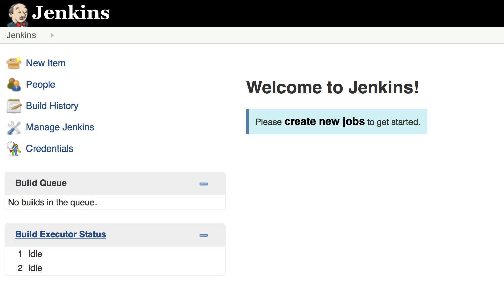

## Contents

1. Hello, Jenkins World!
2. CI: Fetching and building code
3. CoDe: Testing and evaluating code
4. Pretested Integration
5. Extending Jenkins
6. Everything as code

>>>>NEWSECTION

>>>>NEWSECTION

> "Our highest priority is to satisfy the customer
through early and continuous delivery
of valuable software."

## Why use a continuous integration server?

>>>>NEWSLIDE

> " Working software is the primary measure of progress. "

## Do my changes work:

  * on someone else's machine?
  * with everyone else's changes?
  * on all platforms?

>>>>NEWSLIDE

> "Deliver working software frequently, from a
couple of weeks to a couple of months, with a
preference to the shorter timescale."

## Does my software:

  * Build itself?
  * Test itself?
  * Deploy itself?

>>>>NEWSLIDE

> Simplicity--the art of maximizing the amount
of work not done--is essential.

## Is my team:

  * Automating repetitive manual work?
  * Discovering errors quickly?
  * Avoiding rework?

>>>>NEWSECTION

## So, an automation platform helps us:

 * ensure our software is working
 * increase our development efficiency
 * work in teams

Not bad, eh?

>>>>NEWSECTION

##  Let's have a chat about the difference between CI and CoDe...

>>>>NEWSECTION

Note:  Let's talk about the difference between CI and CoDe

>>>>NEWSECTION

##  So for both CI and CoDe...we need an automation platform!

>>>>NEWSECTION

##  We have options!

>>>>NEWSECTION

## But today we choose jenkins!

>>>>NEWSECTION

## Let's get to work!

    docker run -p 8080:8080 -p 50000:50000 jenkins
    # Go check <HOST_IP>:8080
    # Create a job
    # Stop the container
    # Restart the container
    # What happened?

>>>>NEWSECTION

## Let's try again :-)

    mkdir jenkins
    docker run --name myjenkins -p 8080:8080 -p 50000:50000 \
               -v $PWD/jenkins:/var/jenkins_home \
               jenkins
    # Go check <HOST_IP>:8080
    # Create a job
    # Stop the container
    # Restart the container
    # What happened?

>>>>NEWSLIDE

