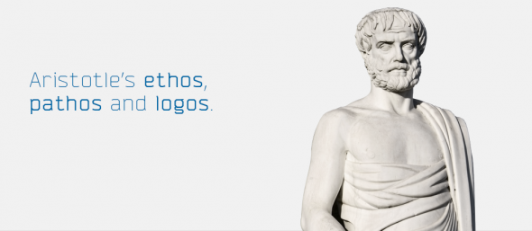
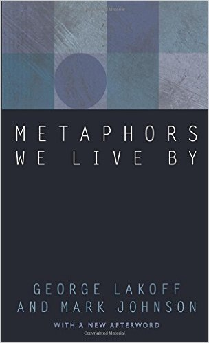
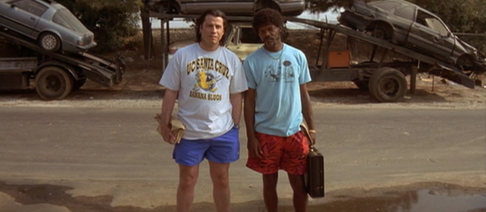
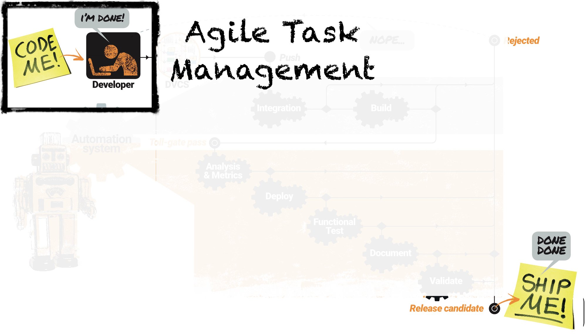
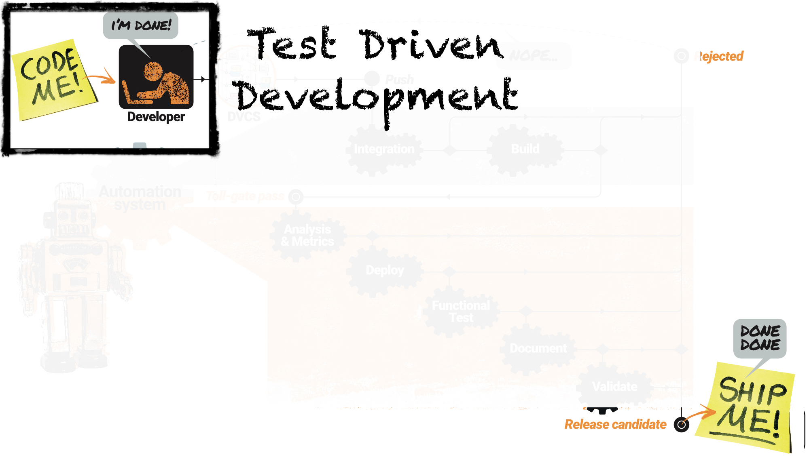
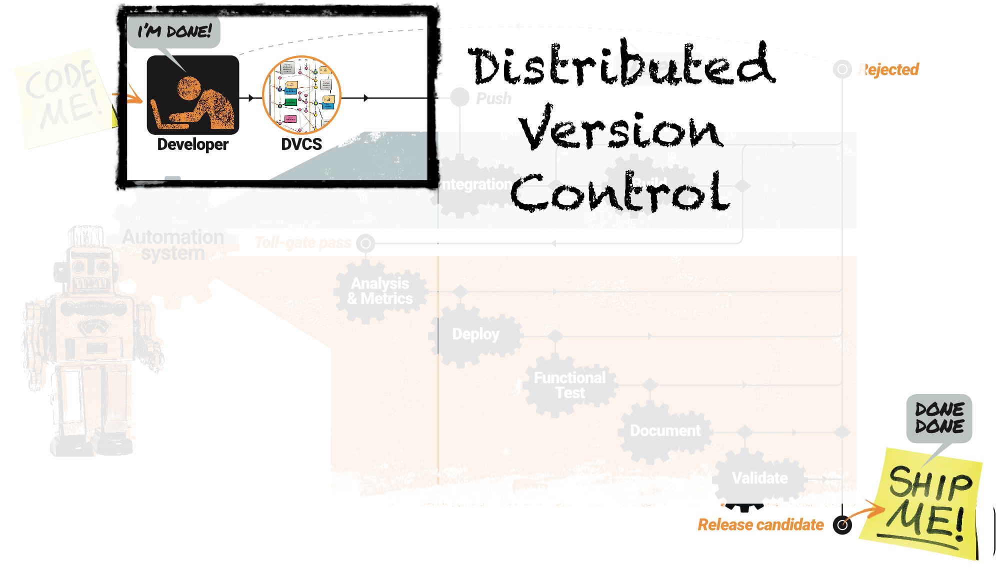
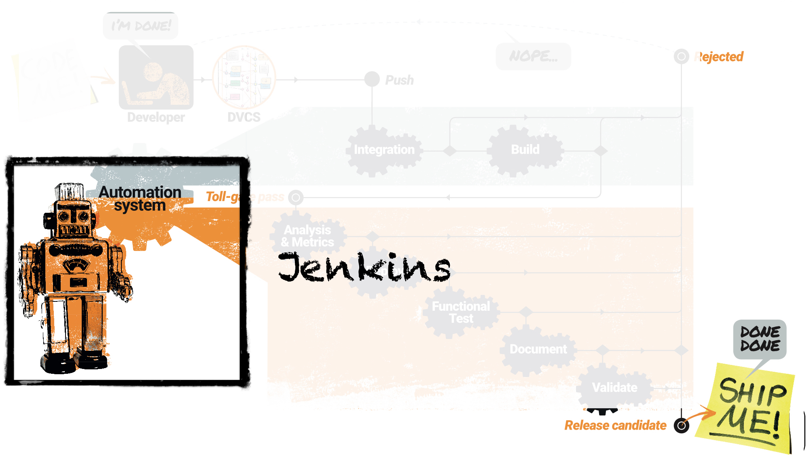
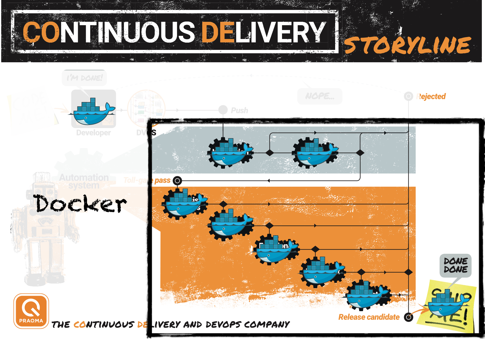
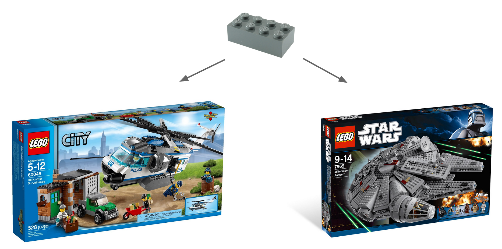

<!--

 To include this markdown in your reveal add the following section:

  <section data-markdown="metaphors.md"
    data-separator="^>>>>NEWSECTION$"
    data-separator-vertical="^>>>>NEWSLIDE$"
    data-separator-notes="^Note:$"
    data-charset="iso-8859-15">
  </section>

-->

## The Metaphors We Live By

#### As DevOps and Continuous Delivery (CoDe) enthusiasts we tend to expand our vocabulary and lingo with metaphors, proverbs and anecdotes that enables us to understand and explain our domain

Buckle up - you're going on a ride with us!

(That's a metaphor!... for this presentation being a car, you are the passengers and we are the reckless drivers. We encourage you to trust us, but for safety measures, we warn you that the road ahead can be rough, so pay attention and keep your hands inside the vehicle at all times)<!-- .element: style="font-size:small;"-->

Mike (@meekrosoft) 
Lars (@lakruzz) 
Praqma (@praqma)
<!-- .element: class="fragment" -->

Note:

Working in Praqma, building the business, holding the bar high for employees and customers.

We've come to realize that while doing that, we build and use a whole portfolio of anecdotes, metaphors, stories and proverbs that help us describe what we're doing and even what we are.

>>>>NEWSLIDE

<!-- .element: class="plain  medium" -->

## Ideas are objects...

* Ideas (or meanings) are _objects_
* Linguistic expressions are _containers_
* Communication is _sending_

Note:

We're enthusiastic and ambitious about what we do, and our goal is to contribute on crystallizing Continuous Delivery and DevOps into it's own unique domain of knowledge and to build a community around it.

At the end of the day, it's about getting the message across, so it can be perceived and understood be the receiver.

>Ideas and meanings are objects, linguistic expressions are containers, and communication is sending.

In essence; the thing you want to communicate is objectified, you want it to be tangible to place or incept at your receiver. You cut and mold and optimize the idea to make i just right - the idea is shaped into a message - you put it into a container. And then you ship it off from you, to the receiver. through some channel, that you find fit for the purpose; a blog, a story, a presentation, a youtube snippet, a tweet.

Most people dealing with communication and rhetoric would agree on this metaphor.

YES - you've just been played a metaphor! In reality:

>Ideas are _not_ objects, Linguistic expressions are not _containers_ and there is no channel you can _send_ the fictional containers on.

But never the less, the metaphor helped you to understand the conceptual idea behind this presentation, that I was trying to send across to you.

So let's embrace em': Metaphors, anecdotes and provers are cool - because they work

>>>>NEWSLIDE

<!-- .element: class="plain" -->

## Rhetorics

In order for an argument, a persuasion or a message to come across, it needs to have _personal character_, _emotion_ and _logic_.

Note:

This presentation is about containers: Not Docker containers, but the containers we use to carry the objectified ideas - which we recognize as messages - that we then ship across.

> in order for an argument, a persuasion or a message to come across it needs to have _personal character_, _emotion_ and _logic_.

Who said that? we'll I just said it, but it old news, it derives from the worlds oldest rhetoric model, made by the father of rhetoric: Aristoteles.

The model describes pathos, ethos and logos.

_Logos_ covers the logical appeal: evidence, facts, data. It's the underlying rationale. They can, themselves, be emotional, social, unsustained - as long at they appear reliable and trustworthy.

It ties to _Ethos_ the personal character, the perceived credibility of the sender of the message. It's your brand and reputation.

Modern research has proven, that people in general are more receptive to the feeling the message impose on them, than the actual content of the message itself.

Well hurray for modern research. Aristoteles new this well before inbound marketing was invented as a concept. It's his _Pathos_.

Just to give you an idea of the range of the emotions _Pathos_ covers, here's a little fun-fact:

> The word _EMPATHY_ derives from Aristotle's _PATHOS_ and so does the word _PATHETIC_

Metaphors are cool and useful simply because because they trigger imagination and afterthought; they put the receiver's mind at work they arise feelings and emotions in the receiver - which means that he - got the message.

>>>>NEWSLIDE

<!-- .element: class="plain small" -->

## How we use the metaphors

Note:

Inspiration comes from Lakoff and Johnsson's "Metaphors We Live By". They make us realize that metophors are everywhere in our everyday language, but more important, they explain why we use then - what purpose they have.

We use metaphors and storytelling in order to explain things that are difficult or complex, to build on the CoDe and DevOps identity, to establish common understanding in teams, to build visions, to create bonds - and for laughs.

>>>>NEWSECTION

<!-- .element: class="plain medium" -->

## The Bonnie Situation

#### Personas ...well; acually _real life fictional characters_

- Mr. Wolf
- Marcellus Wallace
- Jules and Vincent
- Jimmi and Bonnie

Note:

You've probably heard of the concept of creating personas, to represent your end users and customers.

Internally in Praqma, and even externally together with our customers, we're using - well not exactly personas - but actual real life fictional characters.

How many of these persons from Pulp Fiction do you recognize?

--

The Scene in Pulp Fiction is "The Bonnie Situation" it's referring to a highly explosive situation, that has a huge negative impact on end users (or the life of the product).

In this case Jules and Vincent went to collect a suitcase that belonged to Mr. Wallace. They picked it up together with Marvin, who was a junior accomplished acting as insider on the job. Unfortunately - and accidentally - Vincent got to shoot Marvin in the head while he was in the back seat of the Chevy Nova. So now they got brains all over the car, and they need to solve this rather urgent situation, kinda fast.

Vincent and Jules take the car to the garage of a fiend; Jimmi who lives near by, but Jimmi is worried that Bonnie - his wife - wouldn't appreciate the situation.

We now have a delicate Bonnie Situation.

>>>>NEWSLIDE
## The Bonnie Situation

<video  class="stretch"src="res/pulp-fiction-jimmi.mp4" data-autoplay></video>

Note:

__Play the snippet -  this is some serious gourmet shit__

Jimmi and Bonnie represent the end users. Now the product is going sour.
Vincent at Jules represent the customer in this case. They are the employees who work for their boss, Mr. Marcellus Wallace who represent the Customer management

The hard working employees have to call upon their management, to get allocated - well _the cavalry.

>>>>NEWSLIDE

## The Bonnie Situation

<video  class="stretch" src="res/pulp-fiction-marcellus.mp4"  data-autoplay></video>

Note:

OK So it turns out we don't need the cavalry - we just need the right guy for the job. Mr. Wolf is on it. Marcellus - The corporate management, now engages the consultant - Mr. Wolf.

Who is this wolf?

>>>>NEWSLIDE

<!-- .slide: data-transition="slide-in fade-out" -->
## The Bonnie Situation

<video style="width:1000px" src="res/pulp-fiction-ill-be-there-in-ten.mp4" data-autoplay
></video>

Note:

He's obviously fast!

>>>>NEWSLIDE

<!-- .slide: data-transition="fade-in slide-out" -->

## The Bonnie Situation

<video  class="stretch" src="res/pulp-fiction-mr-wolf.mp4" data-autoplay
></video>

Note:

This is really how he presents himself "I'm Winston Wolf, I solve problems!" And later when it's all done Jules and Vincent greet him with a "Than you Mr. Wolf - it's been a pleasure to see you work"

Mr. Wolf is our ideal of a consultant: He's a specialist, he delivers, he's pragmatic, people take pleasure in his work.

I recently told this story about Mr. Wolf to a customer to explain how our senior consultants work. He laughed, but then asked.

>"Are you also solving the problems like Mr. Wolf does"

He was kinda insinuating that that would be to stretch the metaphor too far. But really the answer is "yes!". Mr. Wolfs methods are clearly mostly based on coaching and facilitating:

>>>>NEWSLIDE

## The Bonnie Situation

<video  src="res/pulp-fiction-sugar-on-top2.mp4" data-autoplay></video>

Note:

See, he's actually facilitating the customer's own resources: Vincent and Jules, and through his guidance they are capable of doing work, that they thought was impossible, before Mr. Wolf appeared.

In Praqma, we refer to our senior consultants as Wolves. We refer to the customer's "Bonnie situations", we refer to end users as Jimmi and Bonnie. The customers' smart and competent management we refer to as Marcellus Wallace and the people we team up with onsite at the customers are the Vincent and Jules.

---

This metaphor works:

It's a joke, but still: Internally in Praqma, our employees are seeking to become wolves. Becoming a Wolf is a career path in Praqma.

We even got our customers to refer to out consultants as Wolves

 - that's how we know it works

>>>>NEWSECTION

# The CoDe Journey

>>>>NEWSLIDE

<!-- .slide: data-transition="slide-in fade-out" -->

<!-- .element: class="plain max" -->

### Software as a Factory

Note:

Back to our own world of coding.

We're using a term "Software as a Factory" to create the understanding that software, like the assembly belt on a factory floor, is dependent on a series of related processes, that needs to be carefully designed to each one of them deliver their tiny contribution to the overall product, and each station must do that "at the beat of the drum".

Optimizing a software development process is like optimizing a production plant factory floor that is why LEAN, TPS, Six Sigma, TQM, Production lines are the fathers of the Agile thinking.  We look at our customers software organizations through this lens, looking for queues, wait states, rework and of course automation opportunities.

>>>>NEWSLIDE

<!-- .slide: data-transition="fade-in fade-out" -->
<!-- .element: class="plain max" -->

### Am I doing the right thing?

Note:

So as we investigate the factory, we begin by asking how people choose what to work on.

>>>>NEWSLIDE

<!-- .slide: data-transition="fade-in fade-out" -->
<!-- .element: class="plain max" -->

### Am I doing it right?

Note:

Then we go on to look at how each team member can qualify their work.

>>>>NEWSLIDE
<!-- .slide: data-transition="fade-in fade-out" -->
<!-- .element: class="plain max" -->

### We meet on master

Note:

The next stage is to look at collaboration and integration practices.  Here we have yet another metaphor, the release-train branching strategy.

>>>>NEWSLIDE

<!-- .slide: data-transition="fade-in fade-out" -->
<!-- .element: class="plain max" -->

### Automate everything

Note:

Then we begin to look at the manual processes and gatepoints in the factory, and seek opportunities for automation.

>>>>NEWSLIDE

<!-- .slide: data-transition="fade-in slide-out" -->

<!-- .element: class="plain max" -->

### What we develop, test, deploy and ship is the same

Note:

Finally, we look for opportunities to create consistency and reliability in the factory.

>>>>NEWSLIDE

## Everything "as Code"

Infrastructure, test, software verification, web, graphical design, documentation, slide decks

_...lunch, marketing, conferences_<!-- .element: class="fragment" -->

Note:

Codes has some desirable characteristics that makes it desirable for use for things that behave like code.

- It's strict
- It's syntax can be checked
- It can be persisted in files, and version controlled
- It can be executed
- ...over and over again, to produce the exact same result
- It can be copied and shared
- Configuration can easily be separated for the internal logic
- It can be broken down to smaller components
- ...each with a clear definition of done
- It can be automatically verified in a pipeline

That why we want anything and everything as code:

Infrastructure, test, web, graphical deign, documentation.

>>>>NEWSLIDE
<!-- .element: class="plain max" -->

## Lego

Note:

In Continuous Delivery we need - well deliveries.

An essential ingredient in the CoDe stew is _breaking down the monolith_ into smaller manageable individually releasable components, each with it's own clear definition of done that can be treated as inventory and used by anyone who acknowledges the interface.

This is of course true for all code - even your Jenkins plugins, your maintenance scripts and your Docker containers...

But the perfect metaphor for this is of course Lego blocks - or if we want to give our neighbors som credit too; IKEA furnitures.

Each lego block or has is own clear interface, it's own definiton of done and when quality measures are met, it becomes inventory and dependencies are managed simply by checking that all pieces are there.

Perfect

>>>>NEWSLIDE

<!-- .element: class="plain large" -->

## Gun, Germs and Steel
#### Why the Indonesian Stone Age Population Never Evolved

Note:

Jared Diamond, an anthropologist set out to use his entire career trying to answer the questions

>"Why did the original population the came out of Africa to Eurasia end up concurring the entire world, while the tribe that settled in Indonesia haven really evolved since the stone age"

Jared Diamond’s reasoning is essentially that most of the animals that can be domesticated are only found in Eurasia, which took farming in this region beyond the subsistence level thus freeing up human resources for technical and social development e.g. the smelting of metals like steel and really, the building of civilization.

This domestication of animals also led to an increase in the diseases the Eurasians suffered and subsequently gained some immunity to. So, armed with steel, rapidly developing technology and a shitload of diseases they went off and conquered the world.

While at the same time, the stone age population in Indonesia lived of hard to get, not very nutritious palm heart and marrow. The just barely made it through to survival - all resources were used to chop palms, split them, eat them, breed and then die.

---

We use the analogy to tell why it's important to invest in optimizing surrounding conditions to the best possible, and not to fear the investment in sharpening the tools, it will pay back in the end.

>>>>NEWSLIDE

## Technical Debt
#### ...as in real DEBT!

>"A Lannister always pay his debts"

Note:

We talk about technical debt, we recon that probably most of you do. But that is also a metaphor. But try to stop and dwell with of it for a while.

Did you even think of it as a metaphor? or has it become so much part of your daily lingo that you just use it as a - well technical phrase.

It is actually a not just something that we've accidentally added to our lingo. it's indeed a _brilliant_ metaphor.

Let's add some PATHOS to the - original metaphor DEBT!

The sloppiness, brute force, unconsidered solutions that we some times throw into our code are not all bad - it's just debt.

Debt can easily be managed. like the debt you have on the mortgage on you house, or the loan you took to buy your car.

You don't think of the house as being owned by the bank, you think of it as yours, and the debt too. You have carefully though this through and you have a plan for how to do your paybacks and keeping your debt in check.

You can have technical debt in your code, it's not a problem, but you need to have a plan on how to keep it in check and payback on it, and you need to realize that all debt in the code - even the debt you inherited as legacy  - is yours.

Be a Lannister about it: "A Lannister always pays his debt"

>>>>NEWSECTION

<!-- .element: class="plain small"-->
<!-- .element: class="plain small"-->

## Sayings

>"We don't chop wood - we sharpen axes"

>"Know your tools - practice your knife skills"

>"We never lose"

Note:

A pendant or variant  of the bloody - but edifying - tale of the Bonnie situation is the one that:

"We don't chop wood - we sharpen axes"

Meaning the we don't do repetitively manual work with dull tools. We optimize the process through better sharper tools - that will make everyone else go faster.

It's a reminder to us to check if we are doing the right work, i.e the work that can add the most value.  If we are creating repetitive processes and tasks, we sense that we are chopping wood.  If a customer asks us to chop wood, we know that we should take a step back and look for the higher value fix.

>>>>NEWSECTION

<!-- .slide: data-transition="slide-in fade-out" -->

<!-- .element: class="plain medium" -->

## Wrapping up
#### Metaphors have PATHOS, they can:

- Create an identity
- Guide decision making
- Provide a shortcut to understanding
- Form a socal glue

>>>>NEWSLIDE

<!-- .slide: data-transition="fade-in" -->

## Thank you

<video  src="res/pulp-fiction-its-been-a-pleasure.mp4" data-autoplay></video>

#### ...it's been a pleasure
