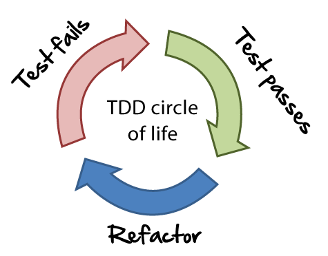
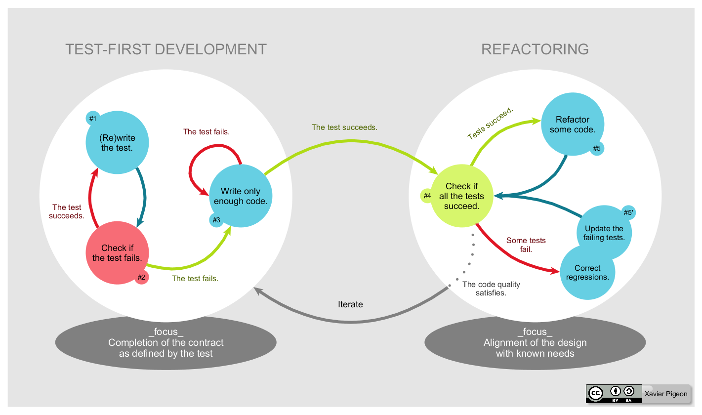
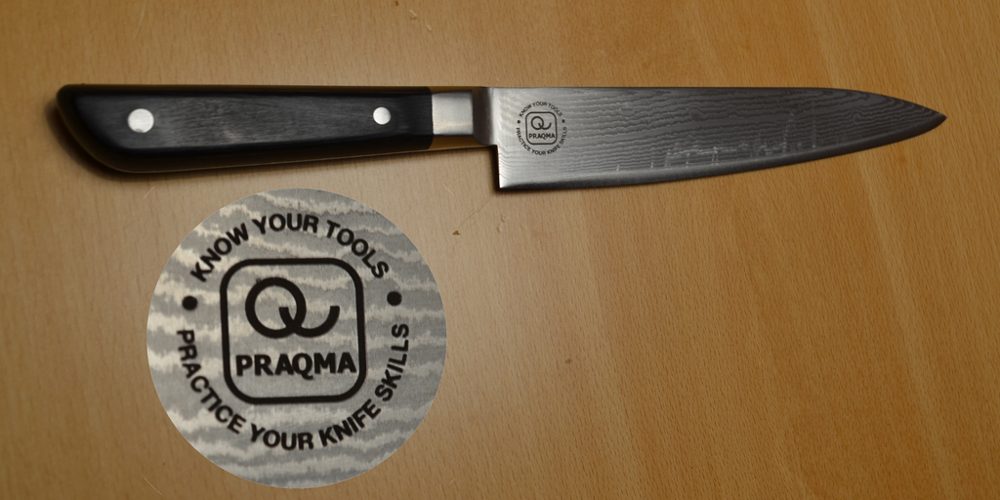
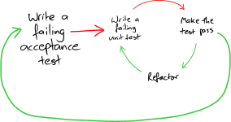
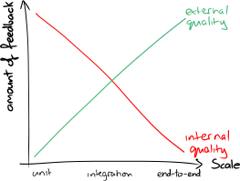

> "Our highest priority is to satisfy the customer
through early and continuous delivery
of valuable software."

>>>>NEWSLIDE

<!-- .element: class="plain max" -->

>>>>NEWSECTION
# What is TDD?

>>>>NEWSLIDE
#Why TDD?

 * Fast feedback loop
 * Simpler code
 * Confidence in the code

>>>>NEWSLIDE

> "George and Williams [12] later conducted a formal TDD experiment with professional pair programmers. They reported that the TDD pairs' product quality was on average 18 percent higher than that of the non-TDD pairs, while their productivity was 14 percent lower."

<small><a href="https://scrumology.com/the-benefits-of-tdd-are-neither-clear-nor-are-they-immediately-apparent/">https://scrumology.com/the-benefits-of-tdd-are-neither-clear-nor-are-they-immediately-apparent/</a> </small>

>>>>NEWSECTION

# How to do Test Driven Development

>>>>NEWSLIDE

## TDD Flow
<!-- .element: class="plain max" -->

>>>>NEWSECTION
# How to be a better programmer

>>>>NEWSLIDE

# Praqtice

>>>>NEWSLIDE

#Practice

When was the last time you wrote some code that wasn't tied to a deadline?

>>>>NEWSLIDE

# Deliberate Practice

When was the last time you practiced writing code together, as a team?

>>>>NEWSLIDE

# Deliberate practice

 * Do not practice in your normal development environment
 * Do not practice alone
 * Learn to go slow
 * Do short timed iterations, reflect, and then start again from scratch.
 * Focus on improvement, not on completion, not on perfection.

>>>>NEWSLIDE
<section data-background-image="img/dojo.jpg">
# Coding Dojo

>>>>NEWSLIDE

## Coding Dojo

 * Working in pairs
 * TDD (Red, Green, Refactor)
 * Doing something you can't comfortably do (yet)

>>>>NEWSLIDE

Our very own dojo <a href="http://cyber-dojo.org/">http://cyber-dojo.org/</a>

>>>>NEWSECTION

# Beyond unit testing

>>>>NEWSLIDE

## Styles of TDD

|TDD Style|Classic|Mockist|
|---|---|---|
| A.K.A | Chicago | London |
| Seam method | Stubs | Mocks |
| Testing | State & Data | Interactions |

>>>>NEWSLIDE

## Outside-in and Inside-out

<!-- .element: class="plain max" -->

>>>>NEWSLIDE

## What kinds of testing do I need?

<!-- .element: class="plain medium" -->

>>>>NEWSLIDE

## Ports and Adapters
<!-- .element: class="plain max" -->

>>>>NEWSLIDE

## Mob Programming

> All the brilliant people working on the same thing, at the same time, in the same space, and on the same computer

>>>>NEWSECTION

# Resources

<!-- .element: class="plain small" -->
<!-- .element: class="plain small" -->
<!-- .element: class="plain small" -->
