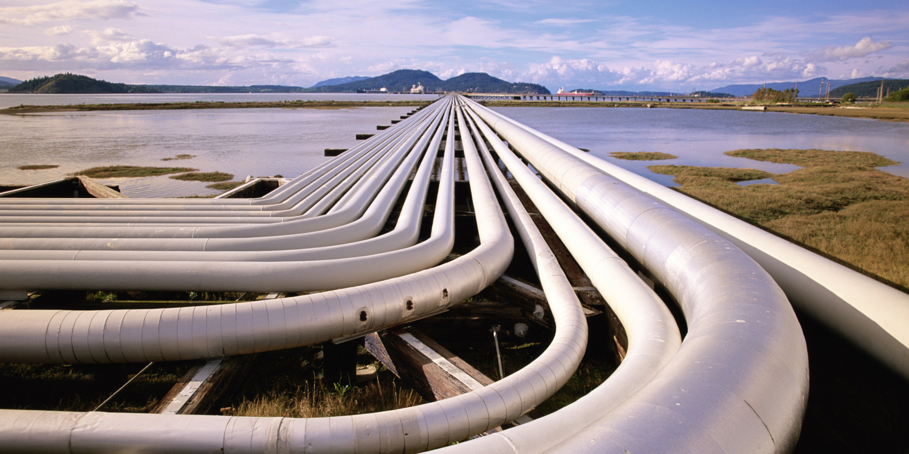

<!--

 To include this markdown in your reveal add the following section:

  <section data-markdown="name-of-your-markdown.md"
    data-separator="^>>>>NEWSECTION$"
    data-separator-vertical="^>>>>NEWSLIDE$"
    data-separator-notes="^Note:$"
    data-charset="iso-8859-15">
  </section>

-->

## The Pipeline Of the Future

<!-- .element: class="plain  medium" -->

Continuous Delivery Pipelines are here to stay - you might as well just go with the flow.

##### The question is really, what will pipelines look like in the future?

Lars (@Lakruzz) 
Sonny (@TheKangBaby) 
Timea (@Timea) 
Jan (@JKrag) 
Praqma (@praqma)

<!-- .element: class="fragment"  style="font-size:small;"-->

Note:

The starting point for this presentation was when I did a presentation and made a statement like "I don't believe that in the future we will be running our pipelines in Jenkins"

>>>>NEWSLIDE

### The Factory Floor

<!-- .element: class="plain max" -->

...in a software development factory<!-- .element: style="font-size:small;"-->

>>>>NEWSECTION

## User Story

As a software developer

I want my pipeline described in a configuration file

So that when I change the configuration it is version controlled and released  together with the code

>>>>NEWSLIDE

## Pipeline As Code

1 repo is 1 component. It has 1 definition of done which is implemented in 1 pipeline

...which is stored and version controlled as code

>>>>NEWSECTION

## User Story

As a software developer

I want the pipeline to run my branch configuration

So that whatever branch I push, it is exactly that branch that is verified.

>>>>NEWSLIDE

## Adaptive Pipelines

Since the pipeline is part of the code, the behavior should be adapted specifically to the individual branch

Note:

Imagine that your compiler would still build an older or different version of your code - even when you changed it.

It wouldn't make sense at all.

If your code is updated, then you update your unit tests, the functional tests the documentation and your pipeline accordingly.

And it's fair to assume, that if you rune the pipeline at this point, it's the new adapted one that runs.

>>>>NEWSECTION

## User Story

As a Software developer

I want to be able to utilize my cloud based build infrastructure to build my local workspace

So that when I execute a local command, it will run the pipeline in the cloud - but with my local files

>>>>NEWSLIDE

## Infrastructure as Code

This is beyond DevOps - it's NoOps!

Our infrastructure is defined as configuration and runs _somewhere_ in the cloud as services.

_Nothing_ runs on my machine!

>>>>NEWSECTION

## Ready for Take-off

<!-- .element: class="plain max" -->

Some of these principles demonstrated in Concourse

>>>>NEWSLIDE

## It's like LEGO

<!-- .element: class="plain medium" -->

Three small building blocks:

- Resources
- Tasks
- Jobs

Combined in infinite composite structures knows as

- Build plans

Enables you to model the entire world

<!-- .element: style="font-size:0.6em;"-->

>>>>NEWSLIDE

## Flight School

[The air field](http://concourse.ci)<!-- .element: target="_blank" -->

[Look Ma' I can fly!](https://concourse.ci/hello-world.html)<!-- .element: target="_blank" -->

[The Concourse flight simulator](https://concourse.ci/flight-school.html)<!-- .element: target="_blank" -->

[CAN it actually fly?](https://concourse.ci/talks.html)<!-- .element: target="_blank" -->

>>>>NEWSLIDE

## Thank you

#### ...it's been a pleasure

[http://code.praqma.com/reveals/the-future-pipeline](http://code.praqma.com/reveals/the-future-pipeline)<!-- .element: target="_blank" -->
